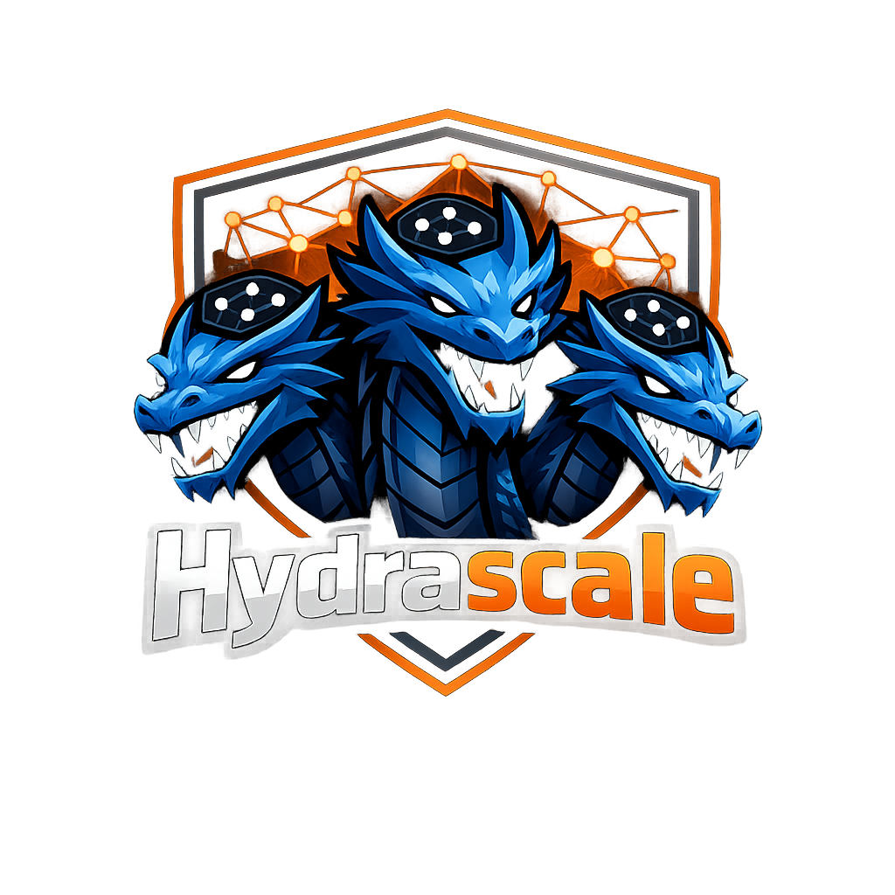

# Hydrascale

<p align="center">
  
</p>

<p align="center">Run multiple Tailscale tailnets simultaneously on a single Linux machine.</p>

## Table of Contents

- [What It Does](#what-it-does)
- [Requirements](#requirements)
- [Install](#install)
- [Quick Start](#quick-start)
- [Host Access](#host-access) -- transparent access to all tailnet peers from the host
- [Config Reference](#config-reference)
- [Networking](#networking)
- [CLI Commands](#cli-commands)
- [Environment Variables](#environment-variables)
- [API](#api)
- [Daemon Mode](#daemon-mode)
- [Architecture](#architecture)
- [Troubleshooting](#troubleshooting)
- [License](#license)

## What It Does

Hydrascale lets a single Linux host participate in multiple Tailscale tailnets at the same time. It creates an isolated network namespace for each tailnet and launches a dedicated `tailscaled` instance inside it, so traffic from one tailnet never leaks into another. Overlapping IP ranges, independent firewall rules, and separate routing tables all work out of the box because every tailnet gets its own network stack.

You declare the tailnets you want in a YAML config file and Hydrascale continuously reconciles the running system toward that desired state. Add a tailnet to the config and it appears; remove it and Hydrascale tears down the namespace, stops the daemon, and cleans up routes. A unified DNS resolver aggregates name resolution across all active tailnets so you can reach any peer by hostname regardless of which tailnet it belongs to.

The reconciler runs as a control loop: on each tick it reads the config, inspects the live system, computes a diff, and applies the minimum set of actions needed. Tailnets that fail repeatedly are placed into an error state and skipped until explicitly reset, preventing a single broken tailnet from disrupting the rest. The event log records every action for debugging and future API use.

## Requirements

- **Linux** (network namespaces are a Linux kernel feature)
- **Go 1.24+** (for building from source)
- **Root or CAP_NET_ADMIN** capability
- **Tailscale installed** (`tailscaled` and `tailscale` commands available in `$PATH`)
- **iproute2** (`ip` command for namespace management)
- **iptables** (NAT masquerading and forwarding rules)
- **Kernel network namespace support** (`CONFIG_NET_NS`, standard on all modern kernels)
- **IP forwarding enabled**: `sudo sysctl -w net.ipv4.ip_forward=1`

## Install

### Binary Download

Download a pre-built binary from the [GitHub Releases](https://github.com/Crank-Git/Hydrascale/releases) page:

```bash
tar xzf hydrascale_*.tar.gz
sudo install hydrascale /usr/local/bin/
```

### Build from Source

```bash
go install hydrascale/cmd/hydrascale@latest
```

Or clone and build manually:

```bash
git clone https://github.com/Crank-Git/Hydrascale.git
cd hydrascale
go build -o hydrascale ./cmd/hydrascale
sudo install hydrascale /usr/local/bin/
```

## Quick Start

1. Create a config file at `/var/lib/hydrascale/config.yaml`:

```yaml
version: 2
tailnets:
  - id: corp-prod
    auth_key: tskey-auth-xxxxx   # optional, for unattended auth
  - id: homelab
    exit_node: exit-us.example.com
resolver:
  mode: unified
reconciler:
  interval: 10s
```

2. Apply the config (one-shot):

```bash
sudo hydrascale apply
```

3. Or run as a daemon with continuous reconciliation:

```bash
sudo hydrascale serve
```

## Host Access

By default, each tailnet is fully isolated in its own network namespace. You can only reach tailnet peers through namespace-scoped commands like `hydrascale exec` or `hydrascale ping`. **Host access** changes this: when enabled, the host machine can transparently reach peers on all managed tailnets as if it were directly connected to each one.

```bash
# Without host access
sudo hydrascale ping havoc bigboy    # works, but requires the wrapper

# With host access
ping havoc-bigboy                     # just works
ssh havoc-mars                        # just works
curl http://havoc-webserver:8080      # just works
```

Enable it globally or per-tailnet:

```yaml
# Global: all tailnets accessible from host
host_access: true

# Or per-tailnet: only specific tailnets
tailnets:
  - id: corp-prod
    host_access: true     # accessible from host
  - id: personal
    host_access: false    # isolated (default)
```

### How It Works

When host access is enabled for a tailnet, Hydrascale does three things each reconciliation cycle:

1. **Host routes** -- adds routes on the host for each peer's Tailscale IP (both IPv4 and IPv6) via the namespace's veth pair. This lets the kernel route packets to the right namespace.

2. **Namespace masquerade** -- adds an iptables masquerade rule inside the namespace on `tailscale0`. This makes traffic from the host appear as if it originates from the namespace's own Tailscale IP, so `tailscaled` forwards it to the peer normally.

3. **DNS entries** -- writes `/etc/hosts` entries so peers are resolvable by name from the host.

All of this is automatic and fully managed. Routes and DNS entries are synced every reconciliation cycle and cleaned up on shutdown or when host access is disabled.

### Naming Convention

Each peer gets a prefixed hostname: `<tailnet-id>-<hostname>`. This prevents collisions when multiple tailnets have peers with the same name.

| Tailnet | Peer | Host Access Name |
|---------|------|-----------------|
| havoc | bigboy | `havoc-bigboy` |
| havoc | mars | `havoc-mars` |
| personal | pixel 8a | `personal-pixel-8a` |
| personal | nas | `personal-nas` |

Hostnames are lowercased and spaces are replaced with dashes.

### DNS Modes

Hydrascale supports two DNS integration modes via the `host_dns.mode` config:

**`hosts` mode (default)** -- Hydrascale manages a clearly marked block in `/etc/hosts`:

```
# BEGIN HYDRASCALE MANAGED BLOCK - DO NOT EDIT
100.98.107.70  havoc-mars
fd7a:115c:a1e0::1  havoc-mars
100.73.198.12  havoc-bigboy
# END HYDRASCALE MANAGED BLOCK
```

This works on every Linux system. The block is updated only when peer data changes (not every cycle) and written atomically. Non-managed entries in `/etc/hosts` are never touched.

**`resolved` mode** -- registers routing domains with `systemd-resolved` via `resolvectl`. Only works on systems with systemd-resolved. No `/etc/hosts` modification.

### Teardown

When host access is disabled for a tailnet (config change or removal), Hydrascale removes:
- All host routes for that tailnet's peers
- The namespace-side masquerade and DNS DNAT rules
- That tailnet's entries from `/etc/hosts` (or systemd-resolved registrations)

On graceful shutdown, all host access state is cleaned up automatically.

### Compatibility Notes

- **Standard Linux distributions**: Full functionality including MagicDNS FQDN resolution via the namespace's DNS forwarder.
- **Tegra/Jetson** (or kernels missing `xt_connmark`): Host routes and prefixed short names (`havoc-mars`) work fully. MagicDNS FQDN resolution (`mars.taildf854a.ts.net`) may not work due to kernel limitations.
- **Systems without systemd-resolved**: Use `hosts` mode (the default). The `resolved` mode is unavailable.

## Config Reference

```yaml
# Config schema version (auto-migrated from v1 if omitted)
version: 2

# Transparent host access to all tailnet peers (default: false)
# When enabled, the host can reach peers on all tailnets directly
# (e.g. ping havoc-mars) without using hydrascale exec.
host_access: false

# List of tailnets to manage
tailnets:
  - id: "corp-prod"              # unique identifier (alphanumeric, dots, hyphens, underscores; max 63 chars)
    exit_node: "node1.example.com" # optional exit node hostname
    auth_key: "tskey-auth-xxxxx"   # optional auth key for unattended setup
    host_access: true              # optional per-tailnet override (overrides global setting)

# DNS resolver settings
resolver:
  mode: unified                  # aggregates DNS across all tailnets
  bind_address: "127.0.0.53:5354"  # optional, defaults to 127.0.0.53:5354

# Host DNS integration mode (only used when host_access is enabled)
host_dns:
  mode: hosts                    # "hosts" (default) manages /etc/hosts entries
  # mode: resolved              # registers with systemd-resolved via resolvectl

# Reconciler settings
reconciler:
  interval: 10s                  # how often the control loop runs (Go duration)
```

## Networking

### IP Forwarding

Hydrascale requires `net.ipv4.ip_forward=1` on the host so that traffic originating inside a network namespace can reach the internet for Tailscale coordination. Enable it for the current session:

```bash
sudo sysctl -w net.ipv4.ip_forward=1
```

To make it permanent, create `/etc/sysctl.d/99-hydrascale.conf`:

```
net.ipv4.ip_forward = 1
```

### Veth Pairs

Each namespace is connected to the host via a veth pair. Interface names are derived from a short hash of the tailnet ID (`vh<hash>` on the host side, `vn<hash>` inside the namespace), keeping names within Linux's 15-character interface name limit. Subnets are allocated from `10.200.N.0/30` where N is an index assigned per tailnet.

### NAT / Masquerade

Hydrascale adds an `iptables` MASQUERADE rule for each namespace so that outbound traffic from the namespace is NATed through the host's default interface and can reach the internet.

### Docker Compatibility

Docker sets the default `FORWARD` chain policy to `DROP`, which blocks traffic between namespaces and the host. Hydrascale detects this and automatically inserts per-namespace `ACCEPT` rules in the `FORWARD` chain so namespace traffic is not silently dropped. No manual iptables configuration is required.

## CLI Commands

```
hydrascale add <id>                   Add a tailnet to config and reconcile
hydrascale apply                      One-shot reconciliation (apply config to system)
hydrascale diff                       Show what would change without applying
hydrascale env <tailnet-id>           Print shell environment for a tailnet namespace
hydrascale exec <tailnet-id> -- <cmd> Run a command inside a tailnet's network namespace
hydrascale install                    Install Hydrascale as a systemd service
hydrascale list                       List all configured tailnets
hydrascale ping <tailnet-id> <target> Ping a Tailscale peer from within a tailnet's namespace
hydrascale remove <id>                Remove a tailnet from config and reconcile
hydrascale serve                      Start daemon mode (continuous reconciliation loop)
hydrascale ssh  <tailnet-id> <target> SSH to a Tailscale peer via a tailnet's namespace
hydrascale status                     Show desired vs actual state for all tailnets
hydrascale switch <id>                Switch the default namespace for direct tailscale CLI usage
hydrascale tailscale <tailnet-id> -- <args>
                                      Run an arbitrary tailscale command inside a tailnet's namespace
hydrascale tui                        Open the monitoring TUI (requires running daemon via serve)
hydrascale wrap <service> <tailnet-id>
                                      Generate systemd drop-in for namespace isolation
```

Use `--config <path>` on any command to override the default config location (`/var/lib/hydrascale/config.yaml`).

If using `hydrascale install` or the systemd service, place the config at `/etc/hydrascale/config.yaml` instead — the systemd unit passes `--config /etc/hydrascale/config.yaml` explicitly.

The namespace-scoped subcommands (`exec`, `ping`, `ssh`, `tailscale`) replace the previous workflow of building raw `ip netns exec` invocations by hand:

```bash
# Before (error-prone)
sudo ip netns exec ns-personal tailscale --socket=/var/lib/hydrascale/state/personal/tailscaled.sock ping Mars

# After
sudo hydrascale ping personal Mars
```

## Environment Variables

| Variable | Description |
|---|---|
| `HYDRASCALE_AUTHKEY_<ID>` | Overrides the `auth_key` field in config for the tailnet whose ID matches `<ID>` (uppercased, with dashes replaced by underscores). Example: for tailnet `corp-prod`, set `HYDRASCALE_AUTHKEY_CORP_PROD=tskey-auth-xxxxx`. |

## API

When running in daemon mode (`serve`), Hydrascale exposes a Unix socket API at `/var/lib/hydrascale/api.sock`. The `tui` and `status` commands connect to this socket when the daemon is running.

| Endpoint | Method | Description |
|---|---|---|
| `/api/status` | GET | Current desired and actual state for all tailnets |
| `/api/events` | GET | Recent reconciler event log |
| `/api/reconcile` | POST | Trigger an immediate reconciliation cycle |
| `/api/tailnet/add` | POST | Add a tailnet to config and reconcile |
| `/api/tailnet/remove` | POST | Remove a tailnet from config and reconcile |
| `/api/tailnet/connect` | POST | Reset error state and reconnect a tailnet |
| `/api/tailnet/disconnect` | POST | Stop a tailnet daemon without removing from config |
| `/api/config/dns` | POST | Update DNS resolver configuration |
| `/api/config` | GET | Get current config (auth keys redacted) |

## Daemon Mode

### systemd Setup

```bash
sudo mkdir -p /var/lib/hydrascale
sudo cp contrib/hydrascale.service /etc/systemd/system/
sudo systemctl daemon-reload
sudo systemctl enable --now hydrascale
```

The provided unit file (`contrib/hydrascale.service`) runs Hydrascale with minimal privileges using ambient capabilities and systemd sandboxing.

### SIGHUP Reload

Sending SIGHUP to the daemon triggers an immediate reconciliation cycle,
re-reading the config file without waiting for the next tick. When managed
by systemd, `systemctl reload hydrascale` sends this signal automatically.

### Graceful Shutdown

Sending SIGINT or SIGTERM causes the daemon to cancel the reconciliation loop and exit cleanly. The daemon stops all running tailnet daemons concurrently (with a 30-second timeout) and then exits cleanly.

### Monitoring

```bash
sudo systemctl status hydrascale
sudo journalctl -u hydrascale -f
```

## Architecture

```
                      +-----------------------+
                      |    config.yaml        |
                      |  (desired state)      |
                      +-----------+-----------+
                                  |
                                  v
                      +-----------+-----------+
                      |     Reconciler        |
                      |  load config          |
                      |  query actual state   |
                      |  compute diff         |
                      |  apply actions        |
                      +-+--------+----------+-+
                        |        |          |
               +--------+   +---+---+   +--+--------+
               v             v           v
    +----------+--+  +------+------+  +-+----------+
    |  Namespace  |  |   Daemon    |  |  Routing   |
    |  Manager    |  |   Manager   |  |  Manager   |
    | (ip netns)  |  | (tailscaled)|  | (netlink)  |
    +-------------+  +-------------+  +------------+
          |                |                |
          v                v                v
    ns-corp-prod     tailscaled         route sync
    ns-homelab       per namespace      per namespace
```

Each reconciliation cycle:
1. **Load** desired state from `config.yaml`
2. **Query** actual state: which namespaces exist, which daemons are healthy, which routes are installed
3. **Diff** desired vs actual to produce a list of actions (create/delete namespace, start/stop daemon, sync routes)
4. **Apply** actions in order; track per-tailnet failure counts
5. After 3 consecutive failures, a tailnet enters **error state** and is skipped until reset

The reconciler acquires a file lock before each cycle to prevent concurrent mutations.

## Troubleshooting

**"bind: address in use" for the API socket**
A stale socket file was left by a crashed daemon. Delete it and restart:
```bash
sudo rm /var/lib/hydrascale/api.sock
sudo hydrascale serve
```

**Namespace traffic can't reach the internet**
IP forwarding is not enabled. Check and enable it:
```bash
sudo sysctl net.ipv4.ip_forward          # should print 1
sudo sysctl -w net.ipv4.ip_forward=1     # enable if not set
```

**Docker blocking namespace traffic**
Hydrascale inserts FORWARD ACCEPT rules automatically, but if traffic is still being dropped, inspect the chain:
```bash
sudo iptables -L FORWARD -v
```
Look for a blanket `DROP` rule positioned before Hydrascale's `ACCEPT` rules and remove or reorder it as needed.

**"name not a valid ifname"**
This error occurs with older Hydrascale versions that used full tailnet IDs as interface names, which exceed Linux's 15-character limit. Update to the latest release, which uses hash-based veth names (`vh<hash>`/`vn<hash>`) that always fit within the limit.

## License

MIT License. See [LICENSE](LICENSE) for details.
