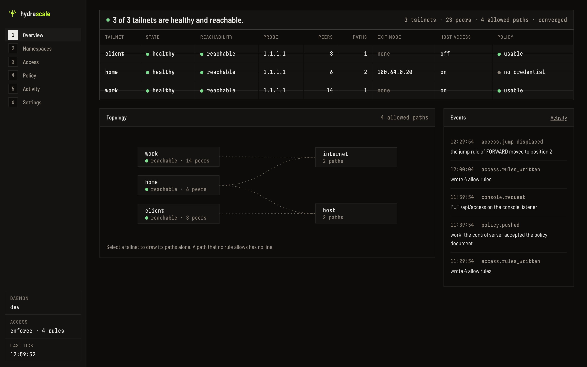

<p align="center">
  
</p>

<h1 align="center">Hydrascale</h1>

<p align="center">Run multiple Tailscale tailnets simultaneously on a single Linux machine.</p>

<p align="center">
  <a href="https://github.com/Crank-Git/Hydrascale/actions/workflows/ci.yml"></a>
  
  
  <a href="LICENSE"></a>
</p>

<p align="center">
  
</p>

## What Hydrascale does

Hydrascale lets one Linux host join more than one tailnet at the same time. The daemon
creates one network namespace for each tailnet, and it runs a separate `tailscaled` in
each namespace. The traffic of one tailnet stays inside the network stack of its
namespace. Overlapping IP ranges, separate firewall rules, and separate routing tables
therefore work with no extra step.

The operator declares the tailnets in a YAML configuration file. The reconciler drives the
live host toward that file. The DNS forwarder answers names across every tailnet, so the
host reaches a peer by name.

The daemon serves a console on the loopback address. It enforces the local rules that the
operator declares, and it reads, validates, and writes the policy that the control server
of each tailnet holds.

## Requirements

- **Linux.** A network namespace is a feature of the Linux kernel.
- **Root.** `hydrascale init` refuses to run as any other account.
- **Tailscale.** The commands `tailscaled` and `tailscale` must be in `$PATH`.
- **iproute2.** The daemon runs `ip` to manage a namespace.
- **iptables and ip6tables.** The `iptables` package of each distribution holds both
  commands.
- **IP forwarding.** Run `sudo sysctl -w net.ipv4.ip_forward=1`.
- **Go 1.26 or later**, for a build from source only.

The [requirements page](https://crank-git.github.io/Hydrascale/get-started/requirements/)
states the kernel options and the IPv6 requirements.

## Install

Install a released binary, or build the binary from source. Both ways put the binary at
`/usr/local/bin/hydrascale`.

To install a released binary, download the archive for the host from the
[GitHub Releases](https://github.com/Crank-Git/Hydrascale/releases) page. Then unpack it
and install the binary:

```bash
tar xzf hydrascale_*.tar.gz
sudo install hydrascale /usr/local/bin/
```

To build from source, clone the repository and build it:

```bash
git clone https://github.com/Crank-Git/Hydrascale.git
cd Hydrascale
go build -o hydrascale ./cmd/hydrascale
sudo install hydrascale /usr/local/bin/
```

`go install` does not work. The module path is `hydrascale`, and the Go module proxy
cannot fetch that path.

## Quick start

The interactive wizard is the shortest path. It does these steps:

1. It runs the preflight checks.
2. It writes the configuration file.
3. It asks for an auth key, or for a login in the browser.
4. It starts the first tailnet.
5. It confirms that the tailnet authenticated.

Start the wizard as root:

```bash
sudo hydrascale init
```

To configure the host without the wizard, do these steps.

1. Write a configuration file at `/etc/hydrascale/config.yaml`:

    ```yaml
    version: 2
    tailnets:
      - id: corp-prod
      - id: homelab
        exit_node: exit-us.example.com
    access:
      mode: enforce
      rules:
        - from: corp-prod
          to: internet
        - from: homelab
          to: internet
    resolver:
      mode: unified
    reconciler:
      interval: 10s
    ```

2. Apply the configuration one time:

    ```bash
    sudo hydrascale apply
    ```

3. Or run the daemon, which reconciles on every tick:

    ```bash
    sudo hydrascale serve
    ```

4. Open the console at `http://127.0.0.1:9443`.

5. Read the state:

    ```bash
    sudo hydrascale status
    ```

A tailnet needs about 20 seconds after a start of the daemon before `hydrascale status`
reports `healthy` and `running`. An earlier read reports `down` and `degraded`, which is a
normal state after a start. If a tailnet still reports `down` after 60 seconds, the
tailnet has a real failure.

The `access` block of this file sets the local rules. The mode `enforce` denies each path
that no rule allows. If the host already uses its tailnets, read
[Local rules](https://crank-git.github.io/Hydrascale/concepts/local-rules/) before you
start the daemon.

## The console

<p align="center">
  
</p>

The daemon serves the console on `127.0.0.1:9443`. The console shows the namespaces, the
local rules, the upstream policy, and the event list. **Warning — the console has no
authentication, and the daemon runs as root.** Any local account on the host reaches the
console and drives the daemon. Read the
[Security](https://crank-git.github.io/Hydrascale/security/console/) section before you
start the daemon on a shared host.

## Documentation

The [documentation site](https://crank-git.github.io/Hydrascale/) states every other
topic.

| Section | Holds |
|---|---|
| [Home](https://crank-git.github.io/Hydrascale/) | What Hydrascale does, and the reconciler. |
| [Get started](https://crank-git.github.io/Hydrascale/get-started/) | The requirements, the install, and the quick start. |
| [Guides](https://crank-git.github.io/Hydrascale/guides/) | The console views, the credentials, host access, and Headscale. |
| [Concepts](https://crank-git.github.io/Hydrascale/concepts/) | The local rules, the upstream policy, DNS, and networking. |
| [Reference](https://crank-git.github.io/Hydrascale/reference/) | The configuration file, the command line, the environment variables, the control API, the events, and the agent skills. |
| [Operations](https://crank-git.github.io/Hydrascale/operations/) | Daemon mode, remote access, the upgrade, the uninstall, and troubleshooting. |
| [Architecture](https://crank-git.github.io/Hydrascale/architecture/) | The namespaces, the veth pairs, and the managers of the reconciler. |
| [Security](https://crank-git.github.io/Hydrascale/security/) | The console risk, its four controls, and the security audit. |

## Agent skills

A skill is one Markdown file that states how a coding agent does one task. The binary
holds the skill set. Run this command as the account that runs the coding agent, without
`sudo`:

```bash
hydrascale skills install
```

The [Agent skills](https://crank-git.github.io/Hydrascale/reference/skills/) page states
each skill and each flag.

## License

MIT License. See [LICENSE](LICENSE) for details.
