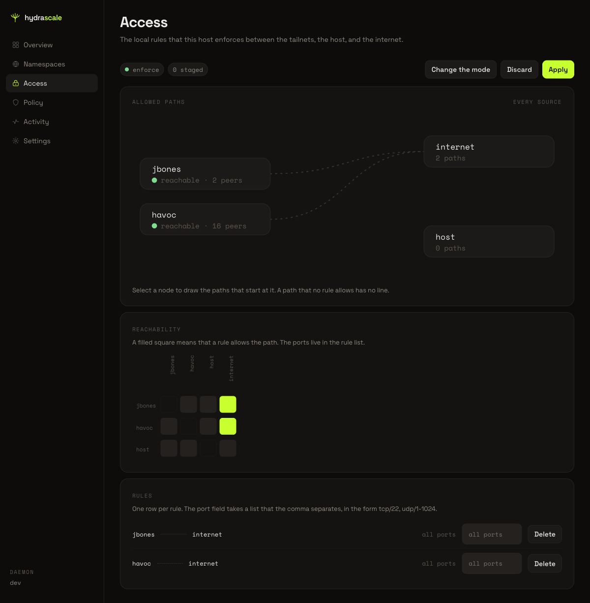
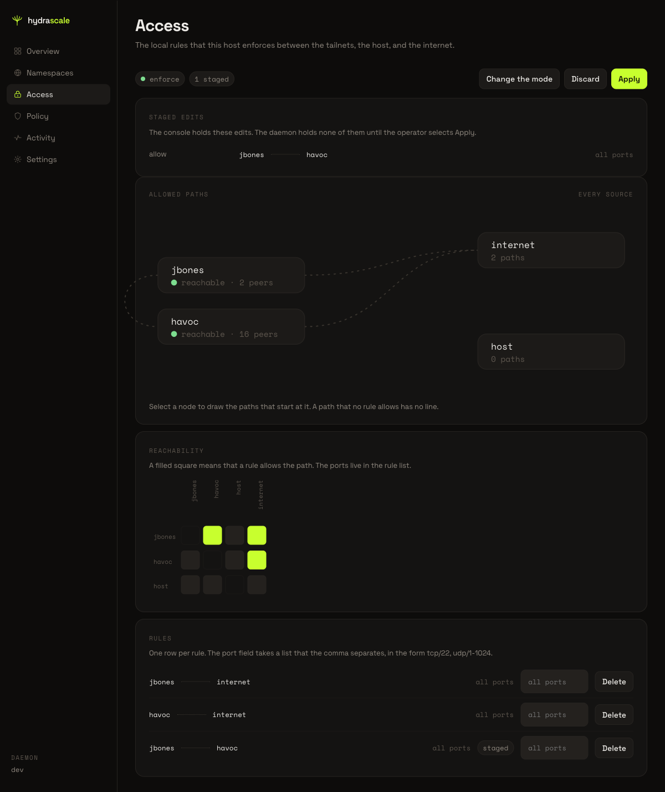
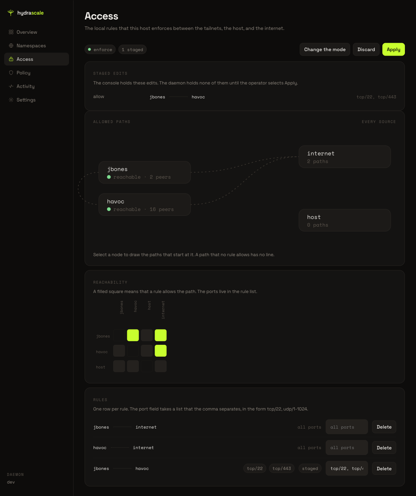
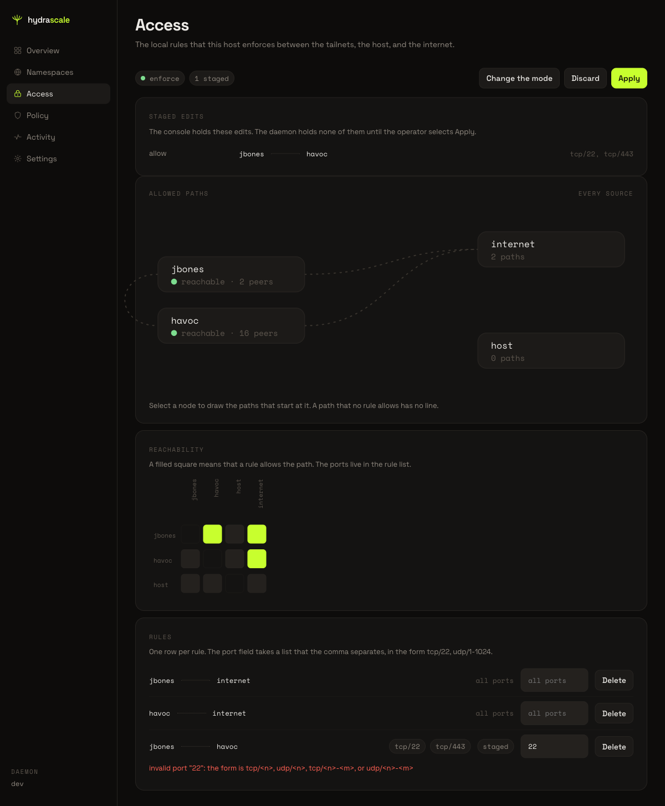
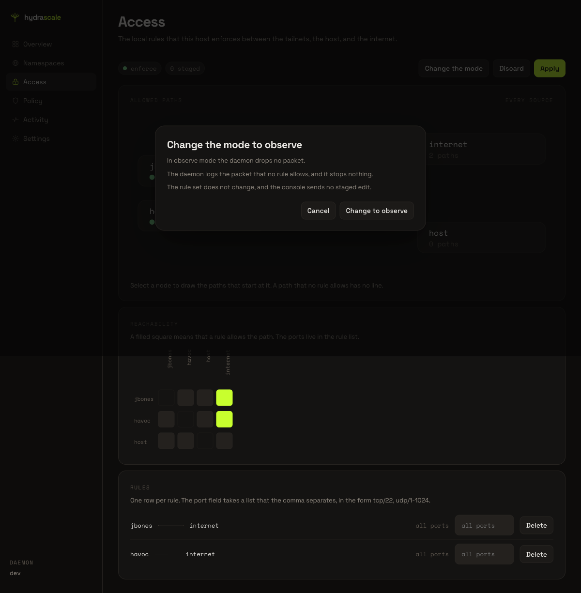
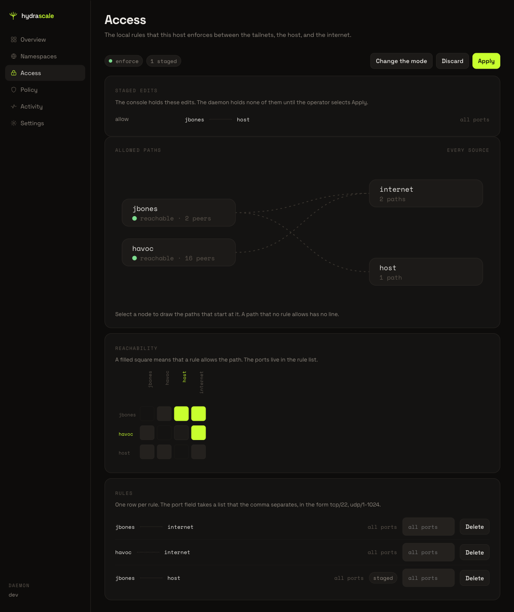

# Change a local rule in Access

This page shows how to stage a local rule in the Access view, enter its ports, and
discard the staged edit. A staged edit changes the console alone. The daemon holds no
staged edit until the operator selects **Apply**.

## 1. Open Access

Click **Access** in the main navigation bar. The view shows the current mode as a
lowercase word, the staged count, and three buttons: **Change the mode**, **Discard**,
and **Apply**. **Discard** and **Apply** stay disabled while the staged count reads
"0 staged".

## 2. Select a source tailnet

Click a tailnet node in the **Allowed paths** diagram. The console highlights the paths
of that tailnet alone and mutes every other node and path. Click the same node again to
show every path again.

## 3. Stage a rule

Click an empty square in the **Reachability** matrix. An empty square carries the label
"no rule". The console:

- stages the rule and raises the staged count by one,
- enables **Discard** and **Apply**,
- opens a **Staged edits** panel that names the new rule,
- adds the new path to the **Allowed paths** diagram,
- fills the matrix square,
- adds a row for the new rule to the rule list below the matrix.

## 4. Enter the ports of a rule

Type a port into the port field of a staged rule. Use the form `tcp/<n>`, `udp/<n>`,
`tcp/<n>-<m>`, or `udp/<n>-<m>`. Separate two or more ports with a comma. The console
draws each port as a separate chip.

> **Caution:** The port field rejects a bare number, because a bare number carries no
> protocol. Enter the protocol before the port number.

If you enter a port in the wrong form, the console shows an error message on the rule
row and keeps the last accepted ports.

## 5. Remove a staged rule

Click the filled square of a staged rule. The console removes the staged rule, the
**Staged edits** panel row, the extra path in the diagram, and the matrix fill together,
and it lowers the staged count by one.

## 6. Read the mode-change dialog

Click **Change the mode**. A dialog opens and states what the new mode does. Click
**Cancel** to close the dialog without a change to the mode.

## 7. Stage a rule for a different path

Repeat step 3 for a different pair of nodes. The console stages the rule the same way,
regardless of which two nodes the rule names.

## 8. Discard the staged edits

Click **Discard**. The console removes every staged edit and returns the view to the
rule set that the daemon holds. The staged count returns to "0 staged", and **Discard**
and **Apply** become disabled again.
