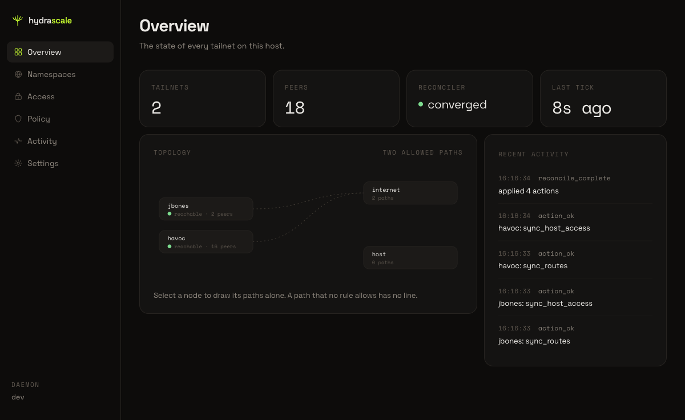
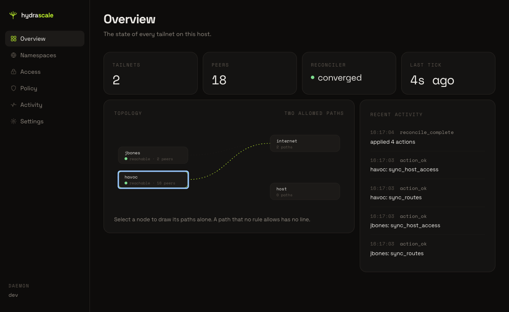
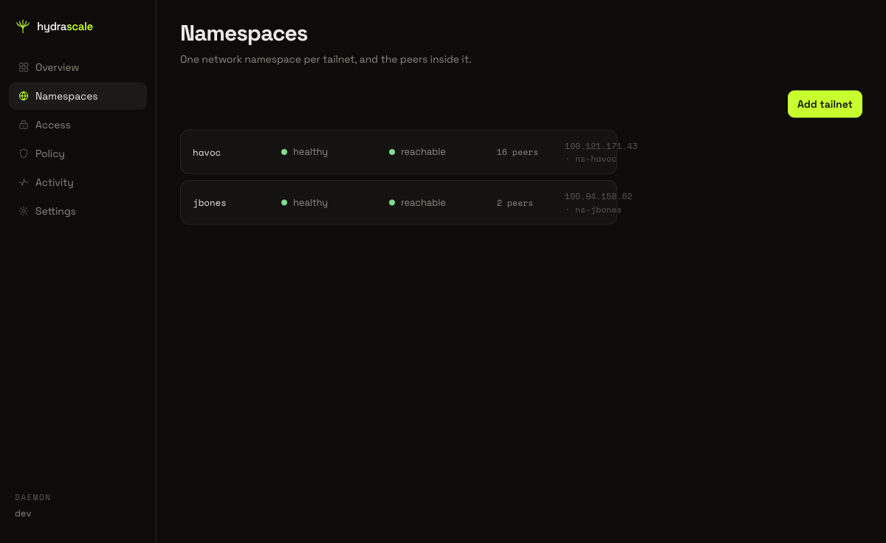
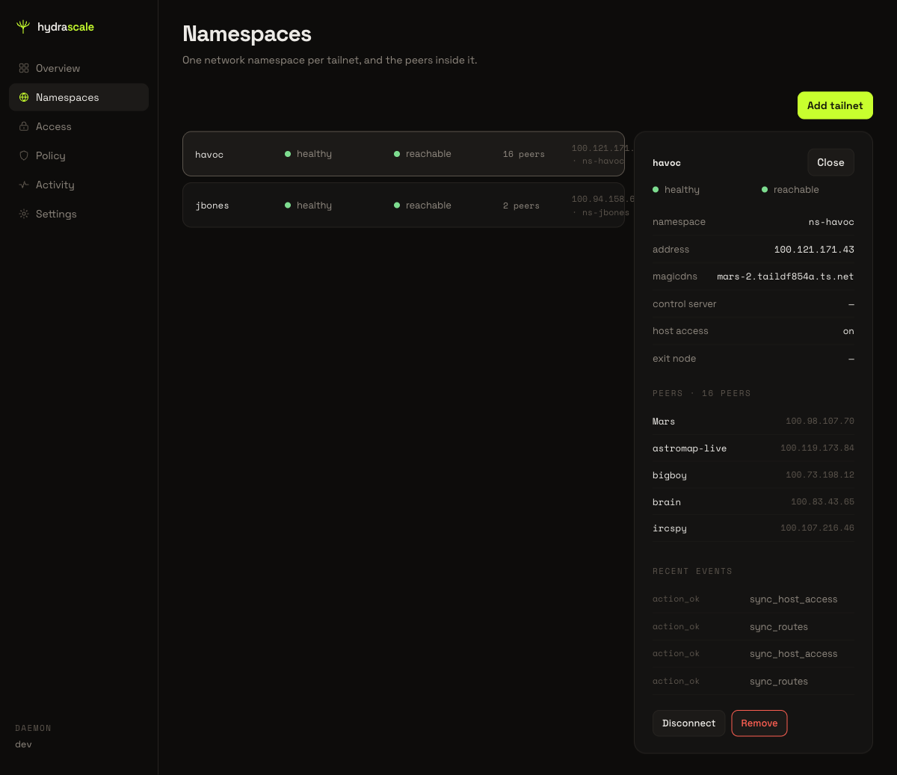
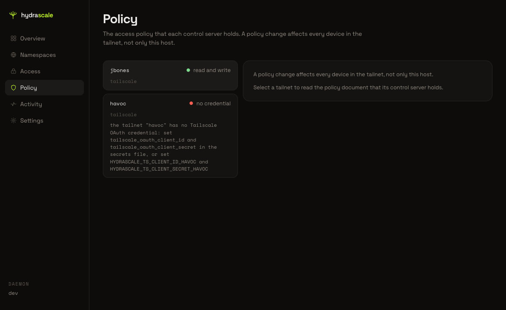
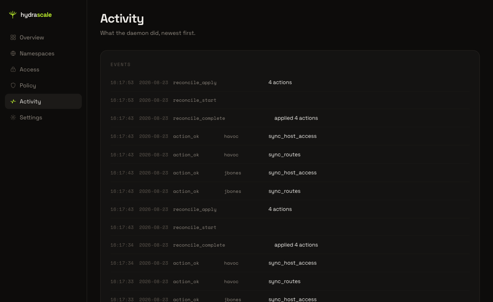
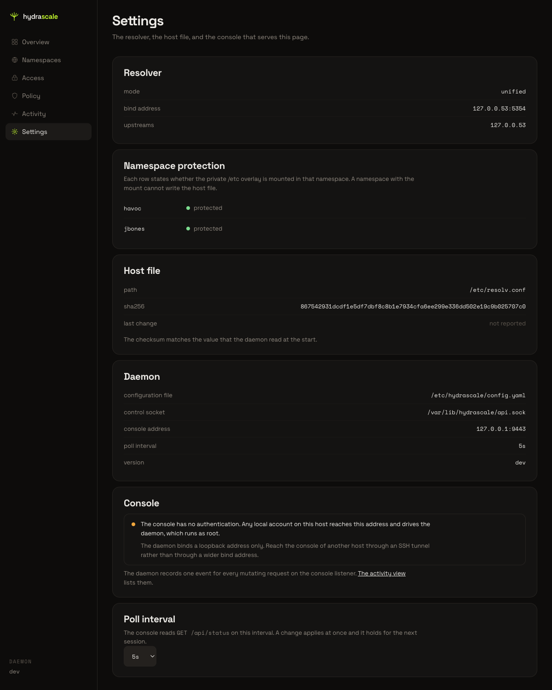

# Get oriented in the console

This page shows the console on first arrival. It names each view in the main navigation
bar and shows what each view reports.

## 1. Open the console

Open the console address in a browser. The console opens on the **Overview** view. The
heading reads "Overview" and the subtitle reads "The state of every tailnet on this
host."

Four tiles report the state of the host: **Tailnets**, **Peers**, **Reconciler**, and
**Last tick**. Below the tiles, a **Topology** diagram draws one node per tailnet, one
node for the host, and one node for the internet. Each node carries a state word and a
peer count. A **Recent activity** feed sits to the right of the diagram.

## 2. Select a node in the Topology diagram

Click a node in the Topology diagram. The console highlights the node and narrows the
path list below the diagram to the paths of that node alone.

## 3. Open Namespaces

Click **Namespaces** in the main navigation bar. The heading reads "Namespaces" and the
subtitle reads "One network namespace per tailnet, and the peers inside it." A list shows
every tailnet.

## 4. Read the detail of one namespace

Click a tailnet in the Namespaces list. The console opens a detail panel for that
tailnet. The panel lists the namespace name, the address, the magicdns name, the control
server, host access, the exit node, the peer list, and a Recent events feed for that
namespace.

## 5. Open Access

Click **Access** in the main navigation bar. The heading reads "Access" and the subtitle
reads "The local rules that this host enforces between the tailnets, the host, and the
internet." The view shows the current mode, the staged count, a Topology diagram filtered
to allowed paths, a reachability matrix, and a rule list.

[Change a local rule in Access](access-editor.md) covers this view step by step.

## 6. Open Policy

Click **Policy** in the main navigation bar. The heading reads "Policy" and the subtitle
reads "The access policy that each control server holds. A policy change affects every
device in the tailnet, not only this host." The view shows a list of tailnets with the
credential state of each one.

[Read and change the upstream policy in Policy](policy-editor.md) covers this view step by step.

A tailnet with no credential shows the reason in the list, and again in the detail panel
after you select it.

## 7. Open Activity

Click **Activity** in the main navigation bar. The heading reads "Activity" and the
subtitle reads "What the daemon did, newest first." A scrolling log lists the events of
the daemon, newest first, and the console adds a new entry as the daemon reports it.

## 8. Open Settings

Click **Settings** in the main navigation bar. The heading reads "Settings" and the
subtitle reads "The resolver, the host file, and the console that serves this page." The
view groups its fields under six headings: Resolver, Namespace protection, Host file,
Daemon, Console, and Poll interval.

The Console section states the following about the console:

> "The console has no authentication. Any local account on this host reaches this
> address and drives the daemon, which runs as root."
>
> "The daemon binds a loopback address only. Reach the console of another host through
> an SSH tunnel rather than through a wider bind address."

