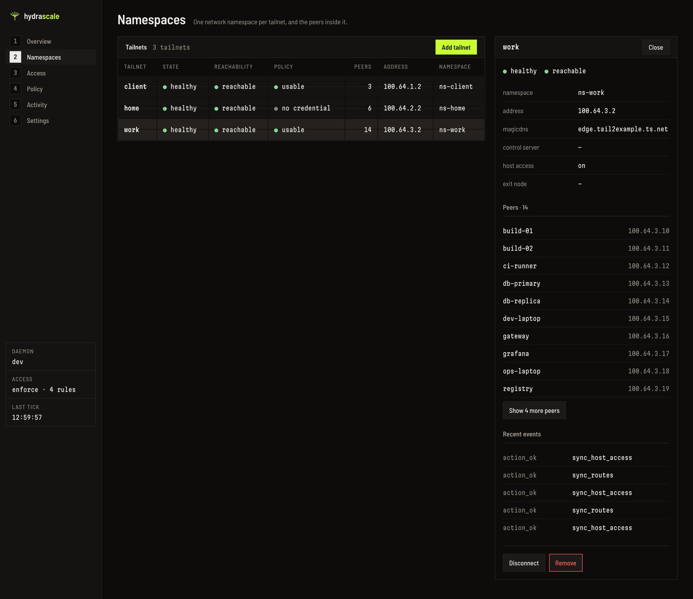

# Get oriented in the console

This page shows the console on first arrival. It names each view in the main navigation
bar and shows what each view reports.

## 1. Open the console

Open the console address in a browser. The console opens on the **Overview** view.

The first line states whether every tailnet is healthy and reachable, and it names a
tailnet with a fault. A board below it holds one row per tailnet: the state, the
reachability, the peers, the allowed paths, the exit node, the host access, and the policy
credential. A row with a fault sorts first. Below the board, a **Topology** diagram draws
one node per tailnet, one node for the host, and one node for the internet. An **Events**
list beside it holds the newest events that are not routine reconcile ticks.

## 2. Select a tailnet

Click a row of the board, or a node in the Topology diagram. The console draws the paths
of that tailnet alone and mutes every other path. On a phone, the diagram is a list of
paths, and a button above the list selects each tailnet.

## 3. Open Namespaces

Click **Namespaces** in the main navigation bar. The heading reads "Namespaces" and the
subtitle reads "One network namespace per tailnet, and the peers inside it." A list shows
every tailnet.

## 4. Read the detail of one namespace

Click a tailnet in the Namespaces list. The console opens a detail panel for that
tailnet. The panel lists the namespace name, the address, the magicdns name, the control
server, host access, the exit node, the peer list, and a Recent events feed for that
namespace.

## 5. Open Access

Click **Access** in the main navigation bar. The heading reads "Access" and the subtitle
reads "The local rules that this host enforces between the tailnets, the host, and the
internet." The view shows the current mode, the staged count, a Topology diagram filtered
to allowed paths, a reachability matrix, and a rule list.

[Change a local rule in Access](access-editor.md) covers this view step by step.

## 6. Open Policy

Click **Policy** in the main navigation bar. The heading reads "Policy" and the subtitle
reads "The access policy that each control server holds." The view shows a list of
tailnets with the credential state of each one.

[Read and change the upstream policy in Policy](policy-editor.md) covers this view step by step.

A tailnet with no credential shows a grey dot in the list, because a credential is
optional. Select the tailnet, and the document frame states the keys that a policy read
needs.

## 7. Open Activity

Click **Activity** in the main navigation bar. The heading reads "Activity" and the
subtitle reads "What the daemon did, newest first." A table lists the notable events of
the daemon, newest first. Select **Every event** to show each reconcile tick as one row,
and select a tailnet to show its events alone.

## 8. Open Settings

Click **Settings** in the main navigation bar. The heading reads "Settings" and the
subtitle reads "The resolver, the host file, and the console that serves this page." The
view groups its fields under six headings: Resolver, Namespace protection, Host file,
Daemon, Console, and Poll interval.

The Console section states the following about the console:

> "The console has no authentication. Any local account on this host reaches this
> address and drives the daemon, which runs as root."
>
> "The daemon binds a loopback address only. Reach the console of another host through
> an SSH tunnel rather than through a wider bind address."

