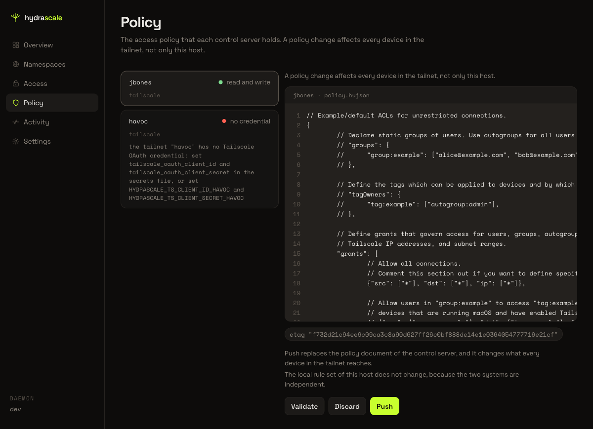
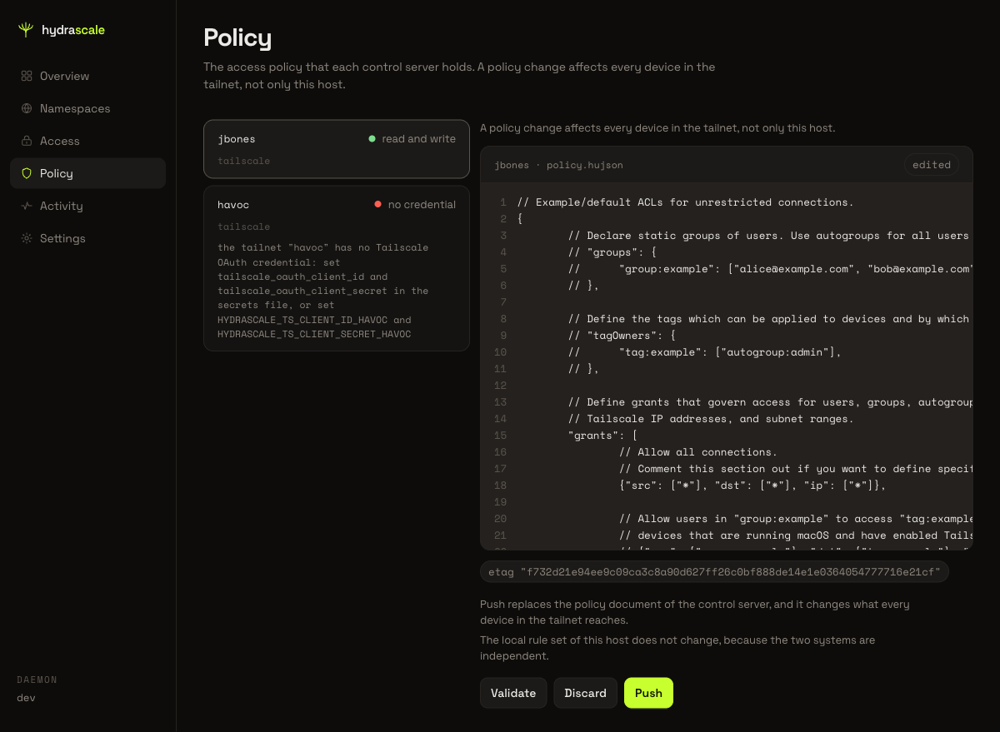
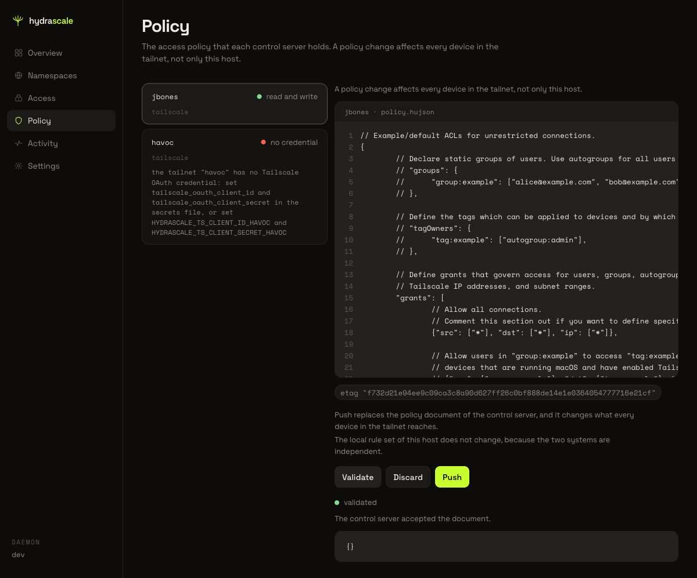

# Read and change the upstream policy in Policy

This page shows the Policy tailnet list, the read-only state of a tailnet with no
credential, and the policy document editor of a tailnet with a working credential. The
Policy view reads and writes the policy document that a control server holds. The
control server applies a policy change to every device in the tailnet, not only to this
host.

## 1. Open Policy

Click **Policy** in the main navigation bar. The heading reads "Policy" and the subtitle
states that a policy change affects every device in the tailnet, not only this host.

## 2. Read the tailnet list

The Policy view opens on a list of every tailnet. Each row names the tailnet, its
credential state as a lowercase phrase (for example, "read and write" or "no
credential"), and its control server kind (for example, "tailscale"). The list shows no
credential value.

A tailnet with no credential carries an inline reason in its row. The reason names the
missing credential and states two ways to supply it: the secrets file, or a named
environment variable pair.

## 3. Open the policy document of a tailnet with a working credential

Click a tailnet row that reads "read and write". The console loads the policy document
of that tailnet into an editor. The editor shows the document text next to a
line-number gutter, the document label (for example, "jbones · policy.hujson"), and
three buttons: **Validate**, **Discard**, and **Push**. On load, with nothing edited,
**Discard** and **Push** are disabled. The pane above the editor repeats the statement
that a policy change affects every device in the tailnet.

> **Known limitation:** This review did not confirm that the line-number gutter scrolls
> with the document text (a fix named in a prior review). The browser tool used for
> this review could not scroll the editor or send a key press, so this page states
> neither that scroll-sync works nor that it fails.

## 4. Edit the document

Type a change into the document text. The console shows an "edited" chip next to the
document label, and it enables **Discard**.

## 5. Revert the document to its original text

Change the document text back to the exact text the console first loaded. The "edited"
chip disappears, and **Discard** becomes disabled again. The console compares the
document to the original text, not to whether the field is empty.

## 6. Validate the document

Click **Validate**. The console sends the document to the control server, which checks
it and writes nothing. On success, the console shows a "validated" result with the
sentence "The control server accepted the document.", and it enables **Push**.

> **Known limitation:** This review did not click Push. Pushing sends the document to a
> live tailnet's control server, so this page does not describe what a push looks like.

## 7. Edit the document again after a successful validation

Type a further change into the validated document. The "edited" chip reappears, the
"validated" result disappears, and **Push** becomes disabled again. Validate the
document again before you push it.

## 8. Return the document to its clean state

Change the document text back to its original text. The "edited" chip disappears,
**Discard** and **Push** are both disabled, and no result shows below the editor. This
is the same state the editor shows on first load.

## 9. Select a tailnet with no credential

Click a tailnet row that reads "no credential". The detail panel repeats the reason from
the list and adds one sentence: "This tailnet needs a credential before the console
reads its policy document." The console draws no editor for this tailnet.

