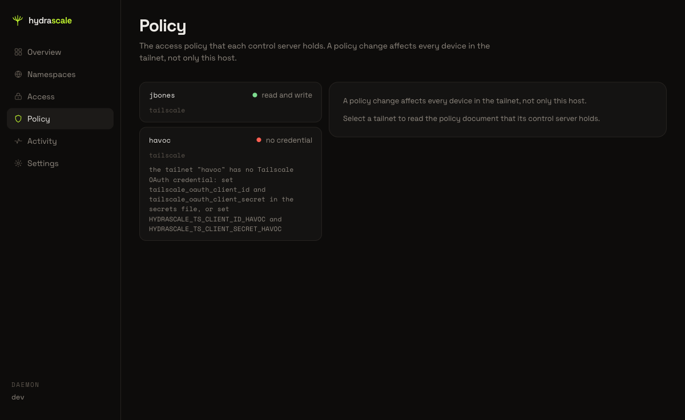
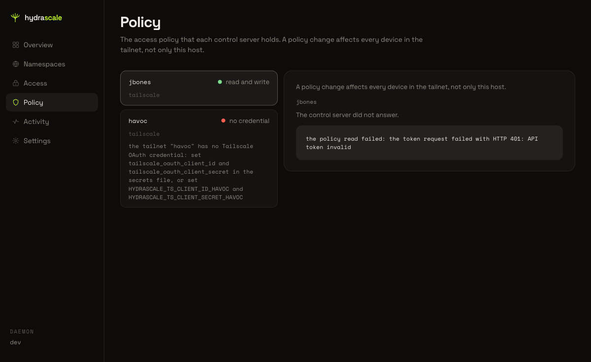
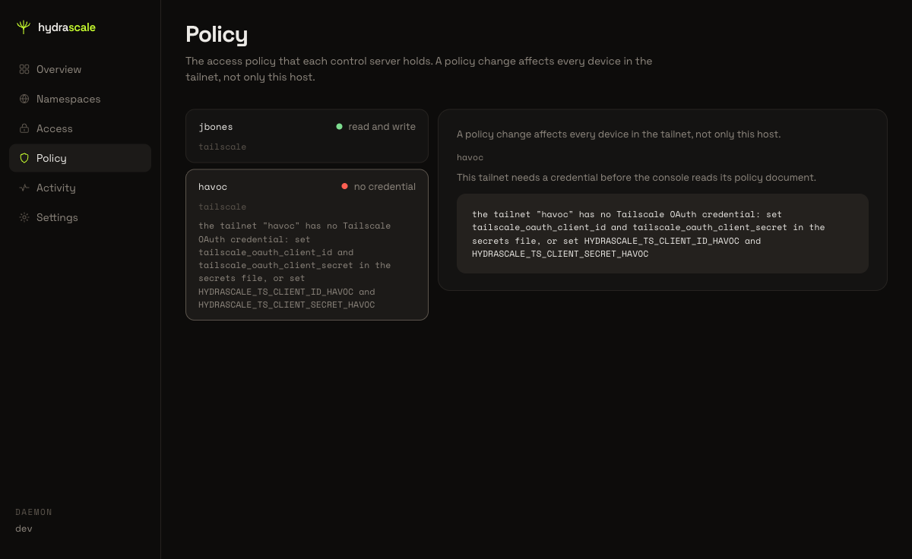

# Read the upstream policy in Policy

This page shows the Policy tailnet list and the state of a tailnet with no credential.
The Policy view reads and writes the policy document that a control server holds. The
control server applies a policy change to every device in the tailnet, not only to this
host.

## 1. Open Policy

Click **Policy** in the main navigation bar. The heading reads "Policy" and the subtitle
states that a policy change affects every device in the tailnet, not only this host.

## 2. Read the tailnet list

The Policy view opens on a list of every tailnet. Each row names the tailnet, its
credential state as a lowercase phrase (for example, "read and write" or "no
credential"), and its control server kind (for example, "tailscale"). The list shows no
credential value.

A tailnet with no credential carries an inline reason in its row. The reason names the
missing credential and states two ways to supply it: the secrets file, or a named
environment variable pair.

## 3. Select a tailnet with a credential error

Click a tailnet row that reads a credential state other than "no credential". The
console asks the control server for the policy document. When the control server
refuses the request, the detail panel names the tailnet and states a plain-English
summary, followed by the message of the control server.

## 4. Select a tailnet with no credential

Click a tailnet row that reads "no credential". The detail panel repeats the reason from
the list and adds one sentence: "This tailnet needs a credential before the console
reads its policy document." The console draws no editor for this tailnet.

> **Known limitation:** This review did not reach the policy document editor for a
> tailnet with a working credential. The tailnet used for this review returned an
> access-token error from its control server, which is an environmental condition of the
> review session and not a defect in the console. This page does not describe the
> editor, line numbers, or the Validate and Push controls, because this review did not
> verify them.
