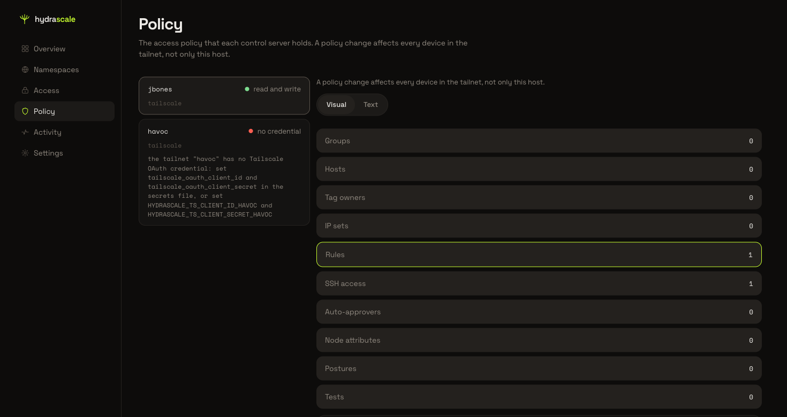
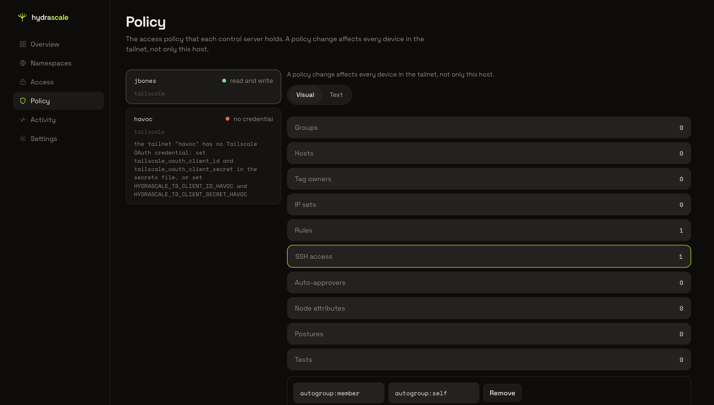
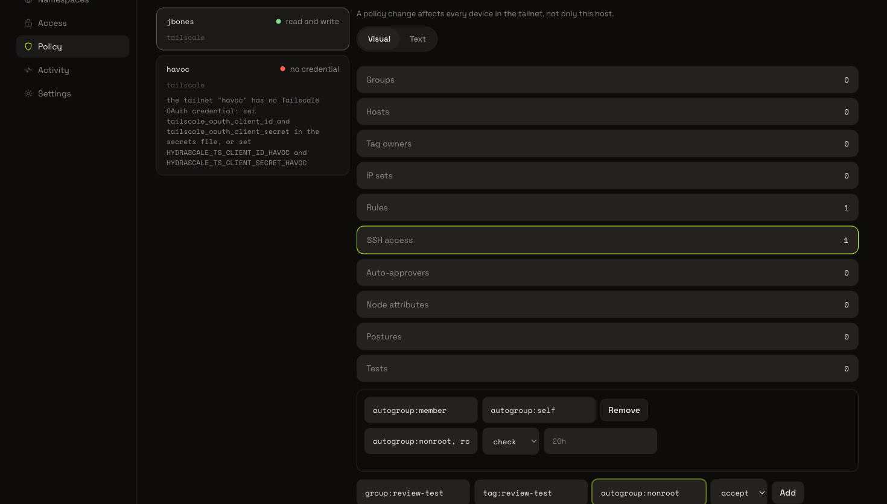
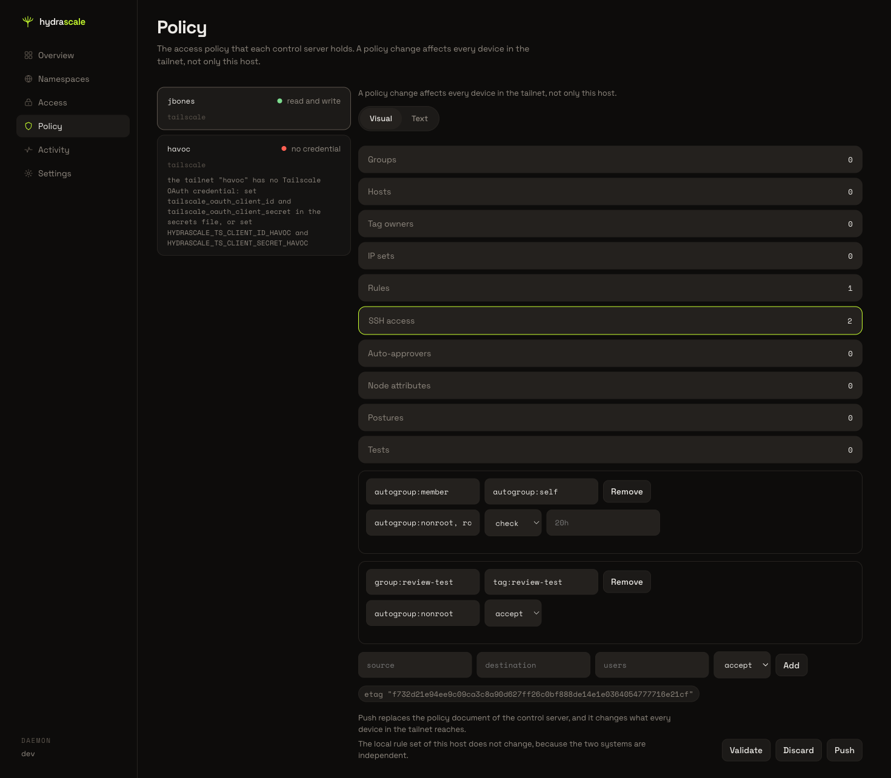
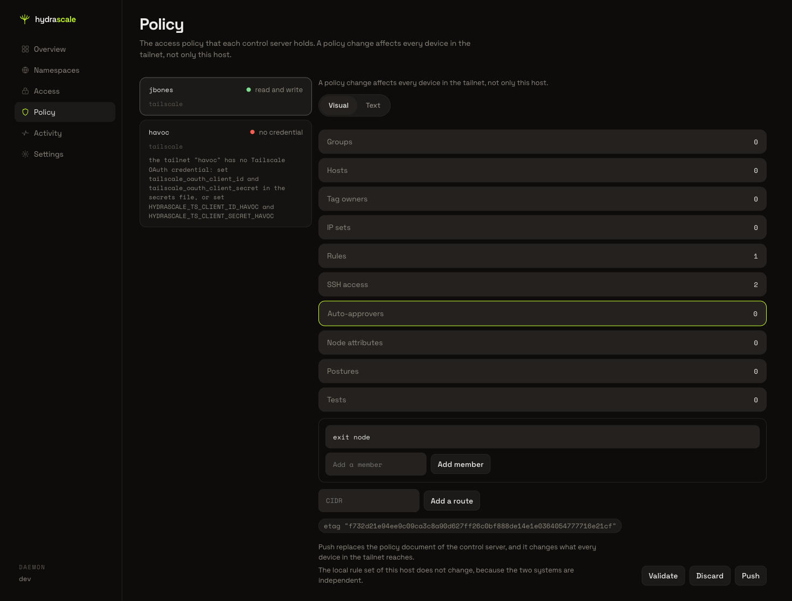
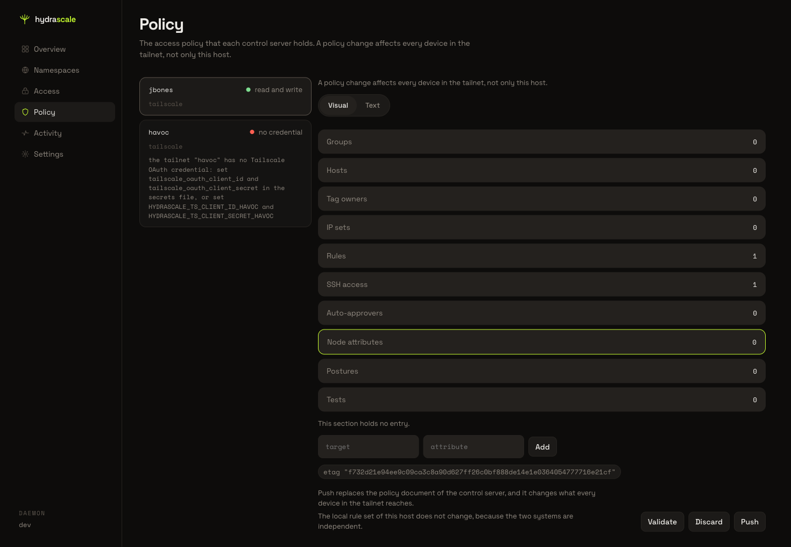
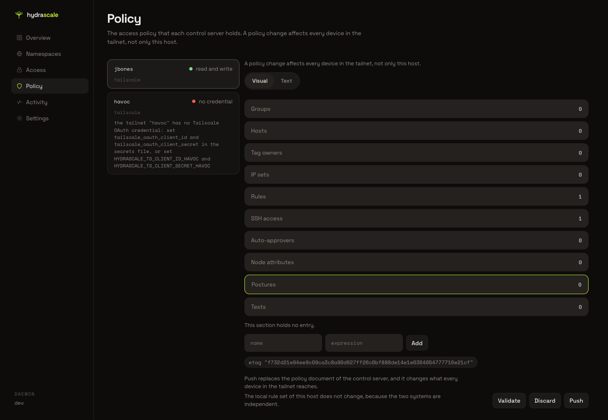
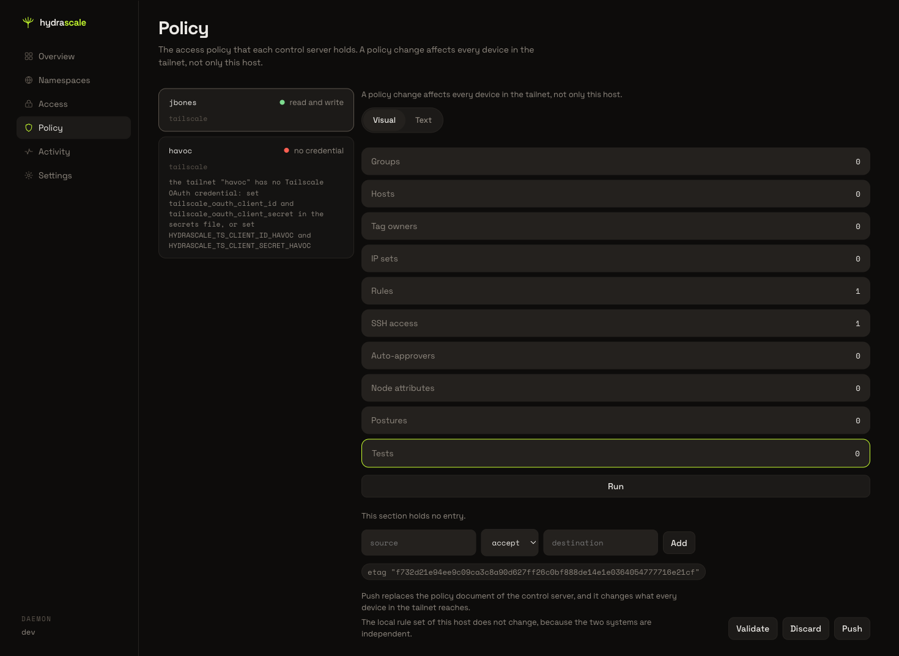
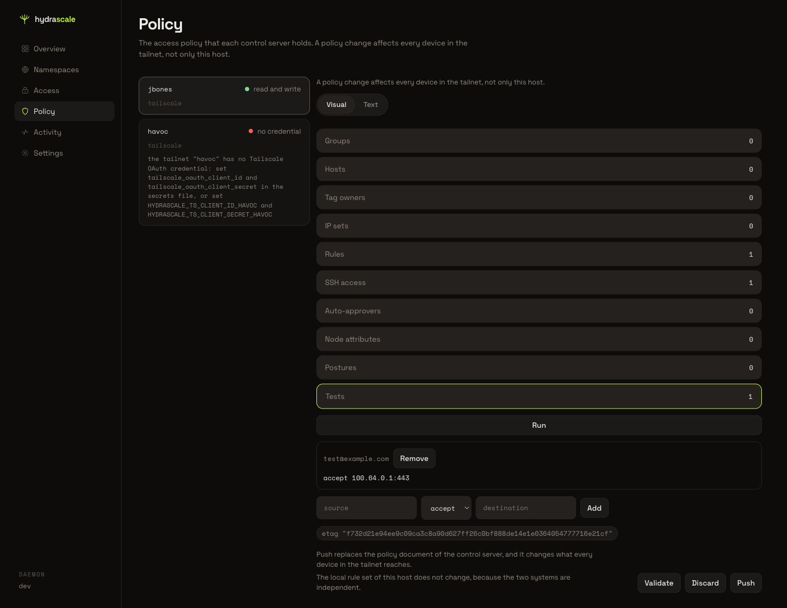
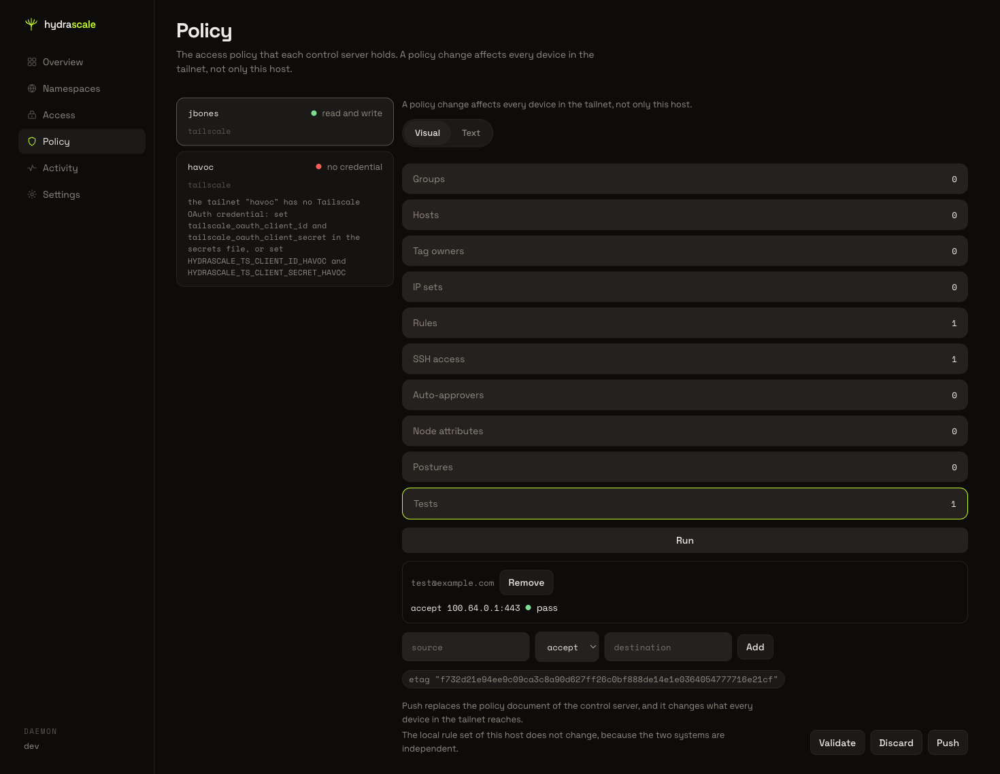

# Use the Visual editor of Policy

This page covers the Visual editor of the Policy view: the section nav, the SSH access
section, the Auto-approvers section, the Node attributes section, the Postures section,
and the Tests section. [Read and change the upstream policy in
Policy](policy-editor.md) covers the Text editor and the Validate, Discard, and Push
buttons that both editors share.

## 1. Open the Visual editor

Open a tailnet that reads "read and write" in the Policy tailnet list. The policy
document loads in the Text editor. Click the **Visual** tab.

The section nav replaces the document text. It lists ten sections, each with a count
of the entries that section holds: **Groups**, **Hosts**, **Tag owners**, **IP sets**,
**Rules**, **SSH access**, **Auto-approvers**, **Node attributes**, **Postures**, and
**Tests**. Click a section to open it. **Rules** opens by default, and shows a
reachability matrix next to the rule list.

## 2. Add an SSH access rule

Click **SSH access**. The section lists every SSH rule of the document: its source,
its destination, its user list, and its action. A "New rule" row sits below the list,
with a **Source** field, a **Destination** field, a **Users** field, an **Action**
list, and an **Add** button.

Type a source into **Source**, a destination into **Destination**, and a user list into
**Users**. Leave **Action** at its default, `accept`.

Click **Add**. The console adds a row for the new rule, and the SSH access count
increases by one. A staged-edits bar appears above the section nav, and it enables
**Discard** and **Push**.

Click **Discard** to remove the staged rule and return the document to its original
text.

## 3. Read the Auto-approvers section

Click **Auto-approvers**. The section lists one row per route CIDR, and one row for
the exit node, each with its approver list. A "New route CIDR" field and an **Add a
route** button sit below the list.

> **Known limitation:** This review found that **Add a route** does not stage a route.
> The console shows an error and disables the Visual tab until the page reloads. Add a
> route through the Text editor instead.

## 4. Read the Node attributes section

Click **Node attributes**. The section lists one row per entry, each with a target
list and an attribute list. A "New entry" row, with a **Target** field, an
**Attribute** field, and an **Add** button, sits below the list.

> **Known limitation:** This review found that **Add** does not stage a node
> attributes entry, and the console shows no error. Add a node attributes entry
> through the Text editor instead.

## 5. Add a posture

Click **Postures**. The section lists one row per posture, each with a name and an
expression. A "New posture" row, with a **name** field, an **expression** field, and
an **Add** button, sits below the list.

Type a name into **name** and an expression into **expression**. Click **Add**. The
console adds a row for the new posture, and the Postures count increases by one. Click
**Discard** to remove the staged posture and return the document to its original text.

## 6. Add a test and run it

Click **Tests**. The section lists one row per test, each with its source, its
expected result, and, once the operator runs the tests, its result. A **Run** button
sits above the list, and a "New test" row, with a **source** field, an
**expected-result** list, a **destination** field, and an **Add** button, sits below
it.

Type a source into **source**, leave the expected result at its default, `accept`,
and type a destination into **destination**. Click **Add**. The console adds a row for
the new test, and the Tests count increases by one.

Click **Run**. The console sends the staged document to the validate route of the
control server, and each row shows its result as a state dot and a word: `pass` when
the destination reaches the expected result, or the reason from the control server
when it does not.

> **A failing test disables Push.** The control server accepts no document whose test
> fails, therefore the console offers no push of such a document. Click **Validate**
> after a row marks `fail`. The result region reads `test failed` and it names that
> reason, and Push stays disabled. Correct the rule that the test names, or remove the
> test, then click **Run** again.

Click **Discard** to remove the staged test and return the document to its original
text.
