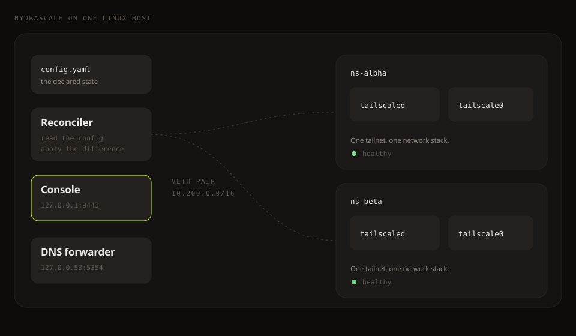

# Architecture



The daemon runs one network namespace per tailnet. A veth pair joins each namespace to the
host. The reconciler, the console, and the DNS forwarder run on the host itself.

## The reconciler

The reconciler builds that state from three managers:

```
                      +-----------------------+
                      |    config.yaml        |
                      |  (declared state)     |
                      +-----------+-----------+
                                  |
                                  v
                      +-----------+-----------+
                      |     Reconciler        |
                      |  read the config      |
                      |  read the live host   |
                      |  compute the diff     |
                      |  apply the actions    |
                      +-+--------+----------+-+
                        |        |          |
               +--------+   +---+---+   +--+--------+
               v             v           v
    +----------+--+  +------+------+  +-+----------+
    |  Namespace  |  |   Daemon    |  |  Routing   |
    |  Manager    |  |   Manager   |  |  Manager   |
    | (ip netns)  |  | (tailscaled)|  | (ip route) |
    +-------------+  +-------------+  +------------+
          |                |                |
          v                v                v
    ns-corp-prod     tailscaled         route sync
    ns-homelab       per namespace      per namespace
```

On each tick, the reconciler also writes the local rules into the chains `HYDRASCALE-FWD`
and `HYDRASCALE-OUT`, and it writes the host routes and the host DNS entries of host
access.

Each tick of the reconciler:

1. **Read** the declared state from `config.yaml`.
2. **Read** the live state: the namespaces that exist, the processes that are healthy, the
   routes that are installed, and the position of the jump rule.
3. **Compute** the difference, which produces a list of actions.
4. **Apply** the actions in order, and count the failures per tailnet.
5. After three failures in a row, place the tailnet in an error state and skip it until the
   operator resets it.

The reconciler takes a file lock before each tick, so two ticks never change the host at
once. The interval between two ticks is `reconciler.interval`, which is 10 seconds by
default. See [The configuration file](../reference/configuration.md).
