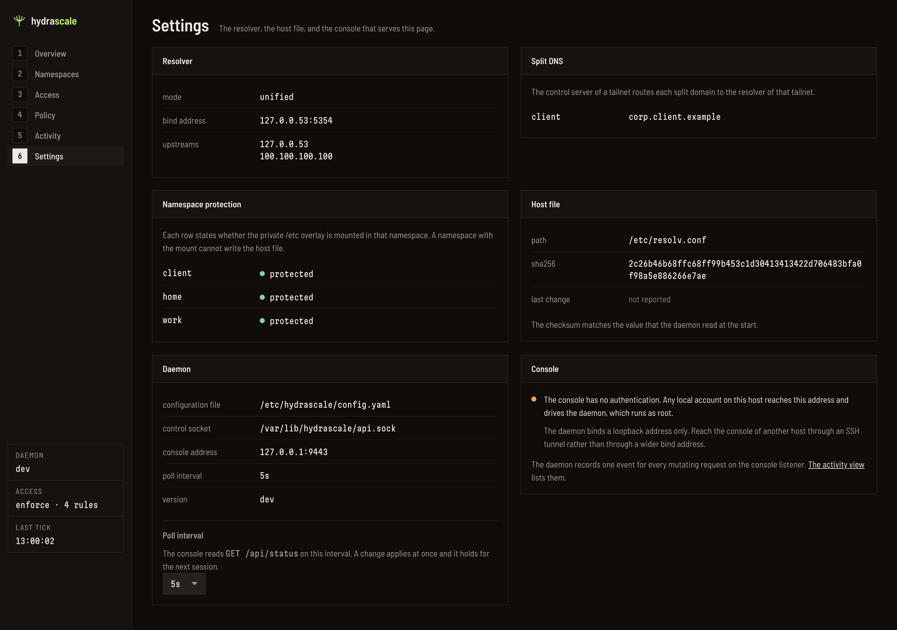

# DNS

This page states how the host resolves the name of a peer in each tailnet. The names
reach the host through [host access](../guides/host-access.md).

## The two host DNS modes

The key `host_dns.mode` selects the mode.

**`hosts`, the default.** The daemon owns a marked block in `/etc/hosts`:

```
# BEGIN HYDRASCALE MANAGED BLOCK - DO NOT EDIT
100.98.107.70  havoc-mars
fd7a:115c:a1e0::1  havoc-mars
100.73.198.12  havoc-bigboy
# END HYDRASCALE MANAGED BLOCK
```

This mode works on every Linux system. The daemon writes the block again only when the
data of the peers changes. It writes the file atomically: it writes a temporary file, and
then it renames that file. It changes no other entry of `/etc/hosts`.

**`resolved`.** The daemon registers routing domains with `systemd-resolved` through
`resolvectl`, on the host side veth device of each tailnet. It registers these domains:

- The MagicDNS suffix of the tailnet.
- The alias zone of the tailnet, when the tailnet has one. See
  [Short names for a peer](#short-names-for-a-peer).
- Every split DNS domain of the tailnet, so a query for a split domain reaches the
  resolver of that tailnet.

The daemon registers no split domain that is `ts.net` or that ends in `.ts.net`, and it
logs each one that it drops. The MagicDNS suffix of the tailnet is not a split domain, so
the daemon registers it. This mode needs `systemd-resolved`, and it changes no file.

## Split DNS

The DNS forwarder routes the same split DNS domains in every mode. A domain can have only
one tailnet:

- A MagicDNS suffix and an active alias zone take their domain first.
- When two tailnets claim the same split domain, the first tailnet in sorted identifier
  order keeps it.

For each conflict, the daemon records a `dns.split_domain_conflict` event. The Settings
view of the console shows the domains of each tailnet in the Split DNS card. It shows
each conflict as a critical alert that names both tailnets.

## Short names for a peer

A MagicDNS name holds the suffix of the control server, such as
`laptop.taildf854a.ts.net`. The key `alias` gives a tailnet a second name, the tailnet
alias. The daemon then answers a name under that alias for the same peer:

```yaml
resolver:
  mode: unified
  resolve_aliases: true
host_dns:
  mode: resolved
tailnets:
  - id: Ta1a1a1a1a1CNTRL
    alias: mmo
    host_access: true
```

With this file, `laptop.mmo.ts.internal` resolves to the tailnet address of the peer
`laptop` of that tailnet. The daemon answers an A record and an AAAA record with a time
to live of 30 seconds. It writes no entry in `/etc/hosts` for this name.

ICANN reserved the top level domain `.internal` in 2024 for private names. A name under
`ts.internal` therefore never collides with a name of the public domain name system.

The name below the alias holds every label that the MagicDNS name holds below the suffix
of the tailnet. If a control server names a peer `a.b.taildf854a.ts.net`, the short name
is `a.b.mmo.ts.internal`. A nested name keeps its shape.

The host resolves a short name only when all of these conditions are true:

- `resolver.resolve_aliases` is `true`.
- `host_dns.mode` is `resolved`. The `hosts` mode writes a file, and a file holds no
  zone.
- The tailnet holds an `alias` and `host_access: true`.

When `resolve_aliases` is set, `LoadConfig` refuses these aliases:

- An alias that is not a DNS label. An alias can hold `_`, and a DNS label cannot.
- Two aliases that differ only by case, because a domain name ignores case.
- An alias that equals the identifier of a tailnet, also when they differ only by case.

### The alias zone

The daemon builds the alias zone as follows:

- The DNS forwarder answers on the host side veth address of each tailnet, on port 53,
  for UDP and for TCP.
- The daemon registers the MagicDNS suffix and `<alias>.ts.internal` on the veth device
  of that tailnet. A link of `systemd-resolved` has one server list for every domain
  that it holds. Both domains therefore reach the forwarder, and the forwarder sends a
  MagicDNS query on to the namespace.
- A query for a name below the alias that the zone does not hold returns NXDOMAIN. The
  forwarder sends no such query to an upstream server.
- The reconciler builds the zone again on each tick. A peer that the control server adds
  therefore resolves within one interval of `reconciler.interval`.

The veth address carries the traffic of the namespace as well as the traffic of the
host. A process inside a namespace can therefore send a packet to this port. The listener
answers the host alone. The host holds one end of every veth pair, and the namespace
holds the other end. A query from an address that no interface of the host holds gets
REFUSED, and the daemon logs the refusal with that address. A namespace therefore reads
no name of another tailnet through this port.

Port 53 of the veth address can already belong to another resolver of the host. The
daemon opens the socket before it registers a domain. If the socket does not open, the
daemon does these steps:

1. It logs the failure.
2. It registers no alias zone on the link. The MagicDNS suffix and the split domains stay.
3. It points the link at the namespace side address.

MagicDNS therefore keeps working, and only the alias zone is absent. The daemon tries to
open the socket again on the next tick.

A name that the key does not cover, such as `laptop.taildf854a.ts.net`, reaches
`systemd-resolved` on the same path as before. The daemon rewrites no query.

The key is unset by default. An unset key changes nothing: the veth device carries the
MagicDNS suffix alone, and the link names the namespace side address.

## The DNS lifecycle of tailscaled

A MagicDNS route per tailnet needs two more steps, and the daemon does both.

**The upstream resolvers of a namespace.** Each namespace gets
`/etc/netns/<ns>/resolv.conf` with the real upstream resolvers of the host. The daemon
reads them from `/run/systemd/resolve/resolv.conf`, or from `/etc/resolv.conf`. It
removes each loopback address. If no address remains, it uses `1.1.1.1`.

The address `100.100.100.100` must not go into that file. `tailscaled` removes its own
address as a loop to itself. The empty resolver chain then returns SERVFAIL for every
query, and the daemon answers no name.

**A refresh after a restart.** The reconciler restarts a `tailscaled` that is not
healthy. The new process loads its state from disk, and it does not read `resolv.conf`
again. Its MagicDNS proxy can therefore stay stopped. On each tick after the restart, the
daemon reads the `BackendState` of the process. When the state is `Running`, the daemon
runs `tailscale set --accept-dns=false` and then `tailscale set --accept-dns=true`. These
two commands build the resolver chain again. DNS therefore recovers after every restart,
and the operator runs no `tailscale set` by hand.

## The overlay mount on /etc

`tailscaled` replaces `/etc/resolv.conf` with a temporary file and a rename each time its
DNS configuration changes. A bind mount on the single file cannot hold a rename. The new
file goes into the shared `/etc` of the host, and it replaces the resolver configuration
of the host.

The daemon therefore starts each `tailscaled` of a namespace under an overlay mount on
`/etc`. The lower layer is the `/etc` of the host. The upper layer is a directory per
tailnet. Every write to `/etc`, which includes that rename, stays inside the namespace.
The process still reads the `/etc` of the host through the lower layer. The daemon never
changes `/etc/resolv.conf` on the host.

`tailscaled` also restarts `systemd-resolved` after each write of its `resolv.conf`, and
the namespace reaches the systemd of the host. Five restarts within ten seconds stop the
resolver of the host. The daemon therefore places `/dev/null` over `systemctl` inside the
mount namespace of each `tailscaled`. That `tailscaled` then restarts no service of the
host.

If a host cannot mount OverlayFS, the start of the namespace fails, and the tailnet
enters the error state. A namespace without the overlay mount can replace the resolver
configuration of the host.

**Warning — a namespace without the overlay mount can change the resolver configuration
of the host.** Set `allow_unprotected: true` only on a host where the overlay mount
cannot work:

```yaml
dns:
  allow_unprotected: false   # default: false
```

With `allow_unprotected: true`, the daemon starts the namespace, and it records the
event `dns.unprotected`. The Overview view of the console shows the namespace as
unprotected.



The Settings view holds the resolver state and the protection state of each namespace.
