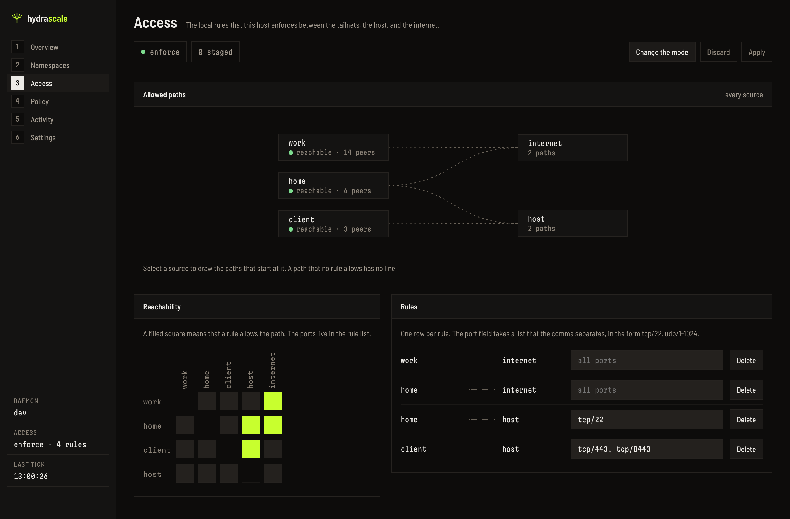

# Local rules

A local rule is one reachability rule that the daemon enforces on the host with iptables.
The rule set is the complete set of local rules for one host. The local rules are the half
of reachability that this host enforces. The [upstream policy](upstream-policy.md) is the
half that each control server enforces.

## The chains of the daemon

The daemon owns the chains `HYDRASCALE-FWD` and `HYDRASCALE-OUT`. It also owns one jump
rule into `FORWARD` and one jump rule into `INPUT`, in each address family. Outside those
chains it writes only the NAT rules of each namespace. See
[Networking](networking.md). The daemon moves no rule of the operator.

## The rule set

The rule set holds no deny rule, because deny is the default. The daemon denies a path
that no rule allows.

```yaml
access:
  mode: enforce        # default: enforce. The other mode is observe.
  rules:
    - from: corp-prod
      to: internet     # every port and both protocols
    - from: host
      to: corp-prod
      ports: ["tcp/22", "tcp/443"]
    - from: homelab
      to: corp-prod
      ports: ["udp/1-1024"]
```

Each rule obeys these conditions:

- `from` names a tailnet that the file declares, or the literal `host`. It never names
  `internet`.
- `to` names a tailnet that the file declares, the literal `host`, or the literal
  `internet`.
- `from` and `to` differ.
- `ports` holds entries of the form `tcp/<n>`, `udp/<n>`, `tcp/<n>-<m>`, or
  `udp/<n>-<m>`. A port number is from 1 to 65535. In a range, `<m>` is not less than
  `<n>`.
- An empty `ports` list allows every port and both protocols.

The daemon validates the whole block before it writes a rule. A rule that names an
unknown tailnet stops the load. The error names every failure together.

## The internet

`internet` means a public address. A rule to `internet` therefore never reaches the local
network of the host.

- For IPv4, `internet` excludes the RFC 1918 ranges, the link-local range, and the
  loopback range.
- For IPv6, `internet` excludes the unique local range `fc00::/7`, the link-local range,
  the loopback address, and each global prefix of the host.

## The two modes

The mode `enforce` drops a packet that no rule allows. The mode `observe` writes a kernel
log line for that packet, and then accepts it.

In the mode `observe`, the tail of each daemon chain accepts the packet. The mode
therefore drops no packet of a namespace. A packet that the tail accepts reaches no later
chain, so `ts-forward`, `DOCKER-USER`, and `DOCKER-FORWARD` do not see it.

Read the log lines of the mode `observe`:

```bash
sudo journalctl -k | grep hydrascale-would-deny
```

The mode `observe` writes at most 60 log lines each minute. Above that limit, the daemon
accepts the packet and writes no log line.

## The first start of version 1.0

**Warning — a first start on a host with no `access` key changes reachability.** If the
configuration file holds no `access` key, the daemon writes one:

1. The daemon copies the file to `<config>.pre-v1.backup`.
2. The daemon writes a rule set with one rule per tailnet, from that tailnet to
   `internet`, in the mode `enforce`.

After this start, no tailnet reaches another tailnet, and the host reaches no tailnet.

**Warning — an `access` block that the operator writes by hand stops the migration.** The
daemon detects the migration by the presence of the `access` key. The operator therefore
gets no preserving rule set and no copy at `<config>.pre-v1.backup`. To start version 1.0
in the mode `observe`, write `mode: observe` and one rule per tailnet to `internet`
together. The section
[To upgrade with no enforcement at all](../operations/upgrade.md#to-upgrade-with-no-enforcement-at-all)
of the upgrade guide holds that order and the steps after it.

## The Access view

The Access view of the console shows the rule set, stages an edit, and applies it. The
reconciler writes the changed rule set on the next tick. To use the view, read
[Change a local rule in Access](../guides/access-editor.md).



A filled square and a drawn curve each mark an allowed path. A denied path has neither.
