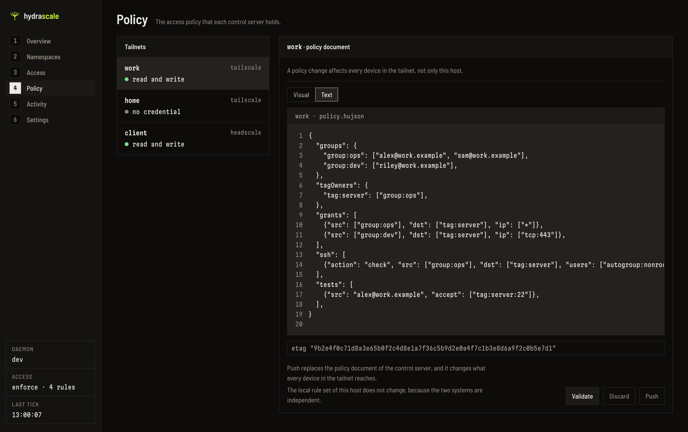

# Upstream policy

A policy is the huJSON access-control document that a control server holds for a tailnet.
The Policy view of the console reads that document, validates it, and writes it back. The
policy is the upstream half of reachability. The [local rules](local-rules.md) are the
half that this host enforces.



If a tailnet holds no credential, the Policy view states the exact keys that a policy read
needs. [Credentials](../guides/credentials.md) states how to give a tailnet a credential.

## The control server kind

The daemon takes the control server kind from the control URL of the tailnet:

- A tailnet that declares no `control_url`, and that takes no global `control_url`, is a
  Tailscale tailnet.
- Every other tailnet is a Headscale tailnet.

[Headscale and a custom control server](../guides/headscale.md) states the key
`control_url`.

## Validate before write

The daemon sends the document to the validate route of the control server before it
writes. If validate rejects the document, the daemon answers HTTP 400 with the answer of
the control server. The write route of the control server then receives no request.

## A conflict

A Tailscale write carries the ETag value of the read in the `If-Match` header. If the
policy changed between the read and the write, the control server answers HTTP 412. The
daemon then answers HTTP 409, and the console reports a conflict. The console keeps the
text of the operator. To compare that text with the current document, select **Read the
document again**. The console reads the document again, and it keeps the text of the
operator.

## Headscale

**A Headscale control server needs `policy.mode: "database"` for a policy write.** A
server in the file policy mode rejects `PUT /api/v1/policy`. The daemon returns the
message of the control server word for word:

```json
{"code":2,"message":"update is disabled for modes other than 'database'","details":[]}
```

`hscontrol/types/config.go:54` of the Headscale source at tag `v0.29.3` declares the two
values:

```go
PolicyModeDB   = "database"
PolicyModeFile = "file"
```

Policy access also needs Headscale v0.29 or later, because an older server has no policy
route.

## The editors

The Policy view has two editors. The text editor shows the document as text. The visual
editor shows the document as sections. To use them, read
[Read and change the upstream policy in Policy](../guides/policy-editor.md) and
[Use the Visual editor of Policy](../guides/policy-visual-editor.md).
