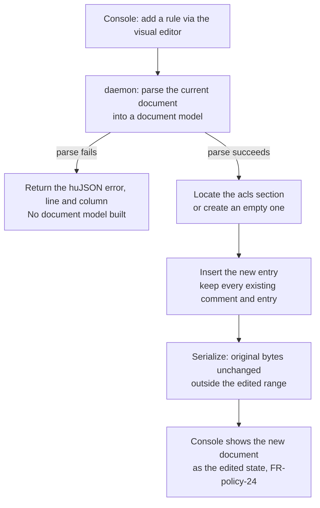
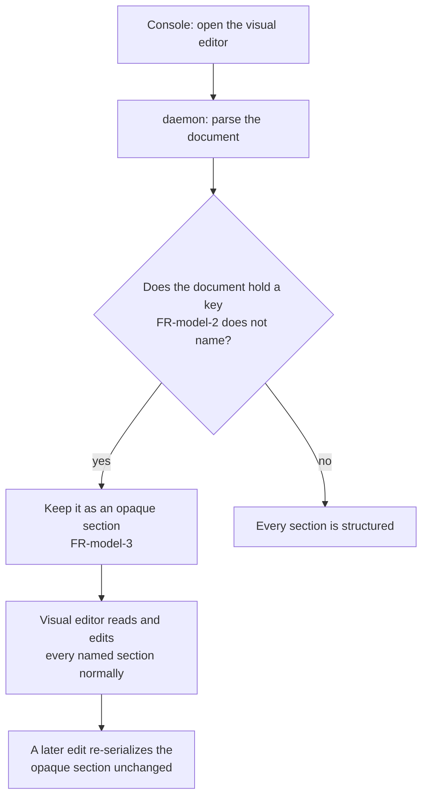

## Purpose

`features/08-upstream-policy.md` reads and writes the policy document as text. This
feature set gives the daemon a structured view of that same text: a document model that
a caller reads as tags, groups, and rules, and edits in place, without changing one byte
that the edit did not touch.

`features/12-visual-acl-editor.md` and `features/13-visual-policy-advanced.md` are the
console screens that a document model makes possible. This feature set builds no screen.
It is the engine underneath both.

## User stories

- As the operator, I want the visual editor to add one rule without reformatting the
  rest of my policy document, so that a colleague's hand-written comment survives my
  edit.
- As the operator, I want a policy document with a construct the visual editor does not
  model to load anyway, so that an unusual document does not lock me out of every edit.

## Functional requirements

### Parsing

- **FR-model-1** — The daemon parses a policy document into a document model that
  preserves every comment, every trailing comma, and the exact byte range of every
  value, which the huJSON grammar allows and `features/08-upstream-policy.md`
  `Behaviour rules` requires the daemon to accept.
- **FR-model-2** — The document model holds one section per top-level key present in the
  document: `groups`, `hosts`, `tagOwners`, `ipsets`, `acls`, `grants`, `ssh`,
  `autoApprovers`, `nodeAttrs`, `postures`, `tests`, `sshTests`.
- **FR-model-3** — A key the document model does not name in FR-model-2 stays in the
  document as an opaque section: the model reads its byte range and writes it back
  unchanged on every edit.
- **FR-model-4** — Parsing a document that does not parse as huJSON returns an error
  that states the line and the column of the failure, and it builds no document model.

### Reading a section

- **FR-model-5** — The document model returns the list of entries of one named section:
  every group with its member list, every host alias with its address, every tag owner
  mapping, every allow rule, every grant, every SSH rule, every auto-approver, every node
  attribute, every posture, every test.
- **FR-model-6** — A section absent from the document returns an empty list, not an
  error.

### Editing a section

- **FR-model-7** — Adding, changing, or removing one entry of a named section changes
  the byte range of that entry and the structural bytes the huJSON grammar requires
  around it (a comma, a bracket), and it changes no byte outside that range.
- **FR-model-8** — An edit inside a section keeps every comment of every other entry of
  that section.
- **FR-model-9** — An edit to a document with no comment and no unusual spacing produces
  output that a human reads as a normal edit: the new entry matches the indentation and
  the quoting style of its neighbours.

### Serializing

- **FR-model-10** — The document model serializes back to huJSON text. Serializing a
  model that received no edit returns the exact bytes it was built from.
- **FR-model-11** — Serializing a model that received one edit returns the original
  bytes outside the edited range, and valid huJSON inside it.

## User flows

### The visual editor adds one rule to a commented document

1. The operator opens the visual editor for a tailnet whose document holds a comment
   above one existing rule.
2. The operator adds a new rule through the matrix.
3. The daemon parses the current document into a document model.
4. The daemon inserts the new entry into the `acls` section.
5. The daemon serializes the model. The comment, and every byte outside the new entry,
   reads the same as before the edit.
6. The console marks the document as edited, per **FR-policy-24**.

### A document holds a construct the model does not name

1. The operator opens the visual editor for a document that holds a key outside
   FR-model-2's list.
2. The daemon parses the document. The unknown key becomes one opaque section.
3. The operator edits an `acls` rule through the matrix.
4. The daemon serializes the model. The opaque section's bytes are unchanged.

## Screens & states

None. This feature set builds no screen.

## Behaviour rules

- The document model never reorders a section relative to another section.
- The document model never reorders the entries of a section the caller did not edit.
- A parse failure never partially builds a model. The caller receives an error or a
  complete model, never one that silently drops a section.
- The document model is a pure function of its input bytes and the edits applied to it:
  the same document and the same edits always produce the same output bytes.

## Data touched

The document model holds no state between requests. It parses the text that
`features/08-upstream-policy.md`'s read route already returns, and it serializes the
text that its write route already accepts. It adds no new entity, no new file, and no
new daemon route of its own — `features/12-visual-acl-editor.md` and
`features/13-visual-policy-advanced.md` add the routes that use it.

## Interfaces

None. This feature set is an internal Go package (`internal/policy/document`, or the
equivalent the implementer chooses), not a route.

## Edge cases & failures

| Case | Behaviour |
|---|---|
| The document is empty. | Every section reads as an empty list. Adding the first entry to a section creates that section's key. |
| The document holds a top-level key twice. | huJSON forbids a duplicate key inside one object; the parse fails per FR-model-4, and it states the line of the second occurrence. |
| An edit removes the last entry of a section. | The section's key stays with an empty list, unless the operator explicitly removes the key, which is a distinct edit. |
| A value inside a named section holds a construct the section's own reader does not name (an object where FR-model-5 expects a string, for instance). | The reader returns an error naming the entry and the expected shape. It does not guess. |
| The document is 400 kilobytes, the limit that `features/08-upstream-policy.md`'s edge cases already state. | Parsing and editing complete within the request's timeout. Epic 11 measures this on the test host before it ships. |

## Acceptance criteria

- [ ] A document with a comment above one rule keeps that comment after an edit adds a
      second rule to the same section.
- [ ] A document whose `acls` section holds four entries, edited to change the ports of
      the second entry, produces output where the first, third, and fourth entries are
      byte-for-byte identical to the input.
- [ ] A document holding an unmodelled key (`randomizeClientPort`, for instance)
      round-trips that key unchanged through an edit to a modelled section.
- [ ] A document that fails to parse returns an error naming the line and the column.
- [ ] Reading a section absent from the document returns an empty list, not an error.
- [ ] Serializing a model that received no edit returns the exact input bytes.

## Out of scope

- Any console screen. `features/12-visual-acl-editor.md` and
  `features/13-visual-policy-advanced.md` own the UI.
- Validating a rule's meaning against Tailscale's or Headscale's grammar beyond huJSON
  syntax — `features/08-upstream-policy.md`'s existing validate route already sends the
  document to the control server for that.
- A merge of two concurrent edits. `features/08-upstream-policy.md`'s existing conflict
  handling (the `ETag` value, HTTP 412 to HTTP 409) still applies unchanged.

## Open questions

None.
