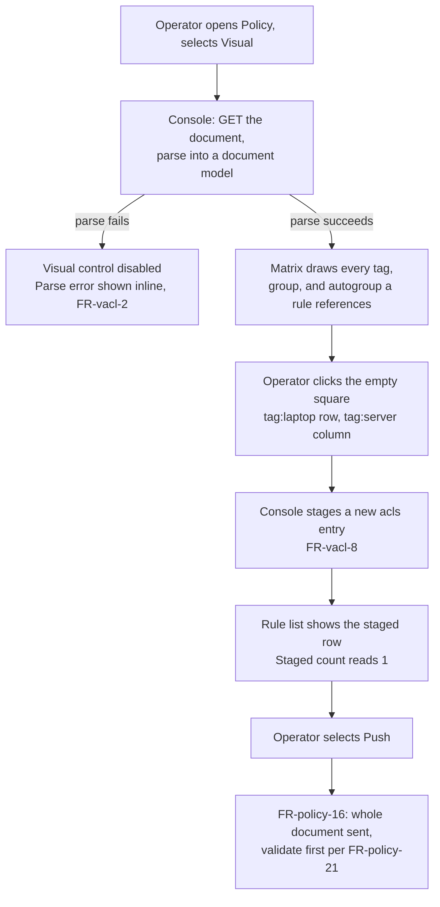
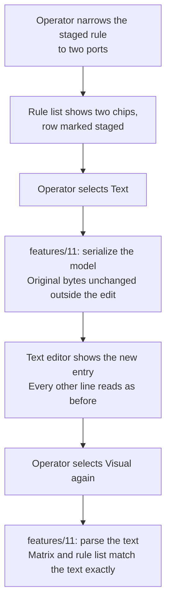

## Purpose

`features/08-upstream-policy.md` shows the policy document as text, by decision of
version 1.0. The operator who wants to allow one tag to reach another still hand-edits
huJSON. This feature set draws the tags, the groups, and the reachability rules of a
policy document the way `features/07-console-access-editor.md` already draws local
rules, and it writes the same document that the text editor edits.

The visual editor and the text editor stay two views of one document. Neither is the
source of truth; the policy document on the control server is. `features/11-policy-document-model.md`
is what lets an edit in one view survive as a normal, readable change to the other.

## User stories

- As the operator, I want to see which tag reaches which tag, so that I understand a
  tailnet's upstream policy without reading huJSON.
- As the operator, I want to add a rule by picking a source and a destination, so that I
  do not write an `acls` entry by hand.
- As the operator, I want to manage the tags and the groups a rule can name, so that I
  do not leave the visual editor to add one.
- As the operator, I want a construct the visual editor does not model to stay in the
  document, so that switching to Visual never deletes something I need.

## Functional requirements

### The view toggle

- **FR-vacl-1** — The policy view carries a Visual and a Text control. Selecting one
  shows that editor; both editors read and write the one staged document.
- **FR-vacl-2** — An edit made in the Text editor appears in the Visual editor on the
  next toggle to Visual, parsed through `features/11-policy-document-model.md`. A
  document the Visual editor cannot parse into a model keeps the Visual control present
  but disabled, and it states the parse error inline.
- **FR-vacl-3** — An edit made in the Visual editor appears in the Text editor as huJSON
  text on the next toggle to Text.

### Reading tags, groups, and named sets

- **FR-vacl-4** — The visual editor lists every group, every host alias, every tag
  owner mapping, and every IP set that the document's `groups`, `hosts`, `tagOwners`,
  and `ipsets` sections hold.
- **FR-vacl-5** — Selecting a section (Groups, Hosts, Tag owners, IP sets) shows its
  entries; the operator adds, renames, or removes an entry, and adds or removes a
  member of an entry.
- **FR-vacl-6** — Removing a tag or a group that a rule still references stages the
  removal and states which rules reference it; it does not remove those rules.

### The reachability matrix

- **FR-vacl-7** — The matrix places every tag, group, and autogroup that a rule
  references on both axes, in the manner of **FR-editor-1** to **FR-editor-15** of
  `features/07-console-access-editor.md`: a filled square means at least one `acls` or
  `grants` entry allows the path, an empty square means none does, the diagonal accepts
  no click, hovering marks the row and the column label alone.
- **FR-vacl-8** — A click on an empty square stages a new `acls` entry that allows every
  port from the row's source to the column's destination.
- **FR-vacl-9** — A click on a filled square stages the removal of every `acls` and
  `grants` entry for that path.

### The rule list

- **FR-vacl-10** — The rule list shows one row per `acls` and per `grants` entry, with
  its source, its destination, its ports (or `all ports`), and a chip naming which
  section it belongs to.
- **FR-vacl-11** — A `grants` entry that carries an application capability shows the
  capability's name in the row, per the mockup's `grant-caps` region. The visual editor
  edits the capability's presence and its name; it does not build the capability's own
  parameter shape, which stays text-only (see Out of scope).
- **FR-vacl-12** — The rule list rejects a port entry in the same form that
  **FR-editor-22** of `features/07-console-access-editor.md` states, and it names the
  same expected format.

### Staging and push

- **FR-vacl-13** — An edit in the visual editor changes the staged document alone. It
  reaches the control server only when the operator selects Push, per
  **FR-policy-16** of `features/08-upstream-policy.md`.
- **FR-vacl-14** — The view shows the count of staged edits and a summary line naming
  each one, in the manner of **FR-editor-24** and **FR-editor-25**.
- **FR-vacl-15** — Discard returns the visual editor, and the text editor, to the
  document that `features/08-upstream-policy.md`'s read route returned.
- **FR-vacl-16** — Push sends the whole edited document, exactly as
  **FR-policy-16** already does. The visual editor introduces no second write path.

### Sections the visual editor does not model

- **FR-vacl-17** — A top-level key that `features/11-policy-document-model.md`
  FR-model-2 does not resolve to Groups, Hosts, Tag owners, IP sets, or Rules (`ssh`,
  `autoApprovers`, `nodeAttrs`, `postures`, `tests`, `sshTests`) is not shown on this
  screen. `features/13-visual-policy-advanced.md` owns those sections.
- **FR-vacl-18** — A key that `features/11-policy-document-model.md` FR-model-3 leaves
  opaque is named once, in a note, so the operator knows to use Text for it. The visual
  editor never states that an opaque key is missing or denied.

### Control server differences

- **FR-vacl-19** — A section that the tailnet's control server does not support (per
  `features/08-upstream-policy.md`'s Headscale distinction — `postures` and `ipsets` on
  Headscale, confirmed against `docs/ref/policy.md` at Headscale tag `v0.29.3`) shows the
  reason in place of the section's editor, in the manner of the mockup's `unsup` region.
  It never silently drops the section from the document.

## User flows

### The operator allows one tag to reach another

1. The operator opens the Policy view, selects `jbones`, and selects Visual.
2. The console reads the document and parses it into a document model.
3. The matrix draws every tag, group, and autogroup that an existing rule references.
4. The operator clicks the empty square at row `tag:laptop`, column `tag:server`.
5. The console stages a new `acls` entry that allows every port.
6. The rule list shows the staged row, and the staged count reads `1`.
7. The operator selects Push. The daemon validates the serialized document, then writes
   it, exactly as `features/08-upstream-policy.md`'s existing flow does.

### The operator narrows a staged rule and switches to Text to check it

1. The operator enters `tcp/22` and `tcp/443` for the staged rule.
2. The operator selects Text.
3. The console serializes the document model. Every line the operator did not touch
   reads exactly as the document read before the visual edit.
4. The operator confirms the new `acls` entry by reading it, then selects Visual again.
5. The matrix and the rule list match the text exactly, because both views read the
   same document model.

## Screens & states

### Policy, Visual — `mockups/06-visual-acl-editor.html`

| Region | Content |
|---|---|
| Header | The heading, the Visual/Text toggle, Discard, Validate, and Push. |
| Context bar | The control server kind, the credential state, the tailnet selector. |
| Staged summary | The staged count and a one-line description of each staged edit. |
| Section nav | Rules, Groups, Hosts, Tag owners, IP sets, each with its entry count. |
| Matrix | The grid of squares, shown under Rules. |
| Rule list | One row per `acls`/`grants` entry, shown under Rules. |
| Unsupported note | States a section the control server does not support, and why. |

| State | What it shows |
|---|---|
| Empty document | No group, no tag, no rule exists. The view states that nothing can reach anything, and it names the matrix as the way to start. |
| Populated | Every allowed path in the matrix, every rule in the list. |
| Unparseable document | The Visual control is present and disabled. The parse error names its line and column. |
| Staged | The staged count, the staged summary, and each staged rule marked in the rule list. |
| Unsupported section | The reason in place of the section's editor, per FR-vacl-19. |
| Push in progress / failed | The same states `features/08-upstream-policy.md` already defines for Push, because Push is one action regardless of which editor staged the edit. |

## Behaviour rules

- One document, two editors. Neither editor is authoritative; the document model is.
- The matrix and the rule list draw the same rule twice only when the document does:
  the visual editor never merges an `acls` entry and a `grants` entry that happen to
  share a source and a destination.
- Denial is the absence of a line and the absence of a row, in the manner of
  `features/07-console-access-editor.md`'s Behaviour rules. The visual editor never
  draws a red edge and never writes the word "denied" as a state label.
- The visual editor stages; Push writes. It applies no edit automatically.

## Data touched

The visual editor reads and writes the same policy document that
`features/08-upstream-policy.md`'s `GET /api/policy/{id}`, `POST /api/policy/{id}/validate`,
and `PUT /api/policy/{id}` already read and write. It creates no new entity.

## Interfaces

**Correction, made during Epic 12 planning (2026-08-23):** the first draft of this
feature file stated no new route. That was wrong. Browser JavaScript cannot parse or
edit huJSON with `features/11-policy-document-model.md`'s byte-preservation guarantee —
only the daemon's Go document model can. The visual editor therefore needs two new
routes, both stateless (the document model holds no state between requests, matching
`features/11-policy-document-model.md`'s Data touched section):

| Method and path | Purpose |
|---|---|
| `POST /api/policy/{id}/sections` | Parses the request body's `document` field through the document model and returns every named section (FR-model-2's list) as JSON, or an error naming the line and column of a parse failure. Read-only: it changes nothing. |
| `POST /api/policy/{id}/sections/edit` | Takes the request body's `document` field, a `section` name, an `op` (`add`, `replace`, or `remove`), an `index` (for `replace`/`remove`), and an `entry` (for `add`/`replace`), and returns the new `document` text — the one edit applied through the document model, every other byte unchanged. |

The console holds the huJSON text as the single source of truth for the staged document
(FR-vacl-1). Every visual edit is: send the current text plus the intended change to
`/sections/edit`, replace the staged text with the response, then call `/sections` to
re-render the matrix and the rule list. The console's own JavaScript never parses or
edits huJSON itself.

## Edge cases & failures

| Case | Behaviour |
|---|---|
| The document holds an `acls` entry whose `dst` is a bare CIDR, not a tag or a group. | The matrix draws it as a destination node labelled with the CIDR, the same as a tag. |
| The document holds a `grants` entry with no `dst` capability, only ports. | The rule list shows it identically to an `acls` entry; the section chip still reads `grants`. |
| Two rules name the same source and destination with different ports. | Both rows appear in the rule list. The matrix square reads filled once. |
| The operator removes the last member of a group that a rule references. | The group stays with an empty member list; the rule stays. Nothing is removed on the operator's behalf. |
| A Headscale tailnet's document holds `postures`. | Per FR-vacl-19, the unsupported note names it. The visual editor still edits every other section normally. |

## Acceptance criteria

- [ ] The matrix draws one filled square per allowed path and no line for a denied
      path, for the tags, groups, and autogroups the document's rules reference.
- [ ] Clicking an empty matrix square stages an `acls` entry and the staged count reads
      `1`.
- [ ] Clicking a filled square stages the removal of every rule for that path.
- [ ] Toggling to Text after a visual edit shows every other line unchanged from the
      document the console read.
- [ ] Toggling to Visual after a text edit shows the matrix and rule list matching the
      new text.
- [ ] A document the visual editor cannot parse disables the Visual control and states
      the parse error's line and column.
- [ ] A section the control server does not support shows the reason and stays
      editable in Text.
- [ ] Push sends the whole document through the same validate-then-write path that
      `features/08-upstream-policy.md` already defines.
- [ ] Removing a tag that a rule references states which rule references it, and
      removes neither on its own.

## Out of scope

- SSH rules, auto-approvers, node attributes, postures, and tests.
  `features/13-visual-policy-advanced.md` owns them.
- Building the parameter shape of an application capability inside a `grants` entry —
  version 1.1 shows a capability's presence and its name; editing its own fields stays
  text-only.
- A rule history or an undo stack beyond Discard, matching
  `features/07-console-access-editor.md`'s equivalent exclusion.
- Renaming a tag or a group everywhere it is used in one action — the operator edits
  the rules that reference it separately.

## Open questions

None.
