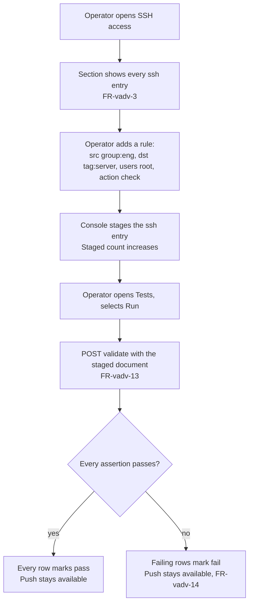
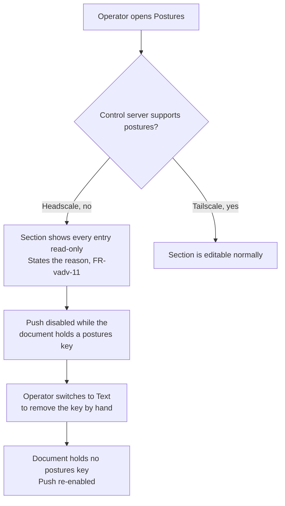

## Purpose

`features/12-visual-acl-editor.md` draws tags, groups, and reachability rules. A policy
document holds five more constructs that decide who reaches a shell, what a device
auto-approves, what attribute a device carries, what posture a control server checks,
and what a test asserts. This feature set draws those five, on the same document that
`features/12-visual-acl-editor.md` and the text editor already edit.

## User stories

- As the operator, I want to see who can reach a shell on which device, so that I do not
  read the `ssh` block by hand to answer that question.
- As the operator, I want to approve a route or an exit node visually, so that I do not
  guess the shape of an `autoApprovers` entry.
- As the operator, I want a posture my control server does not support to stay visible
  as text, so that switching sections never hides it.
- As the operator, I want to see a policy test's result before I push, so that a rule I
  am about to narrow does not silently break an assertion a colleague wrote.

## Functional requirements

### Section navigation

- **FR-vadv-1** — The Policy view's section navigation carries SSH access,
  Auto-approvers, Node attributes, Postures, and Tests, alongside
  `features/12-visual-acl-editor.md`'s Rules, Groups, Hosts, Tag owners, and IP sets.
- **FR-vadv-2** — Each section shows the entry count of its `ssh`, `autoApprovers`,
  `nodeAttrs`, `postures`, or `tests`/`sshTests` block.

### SSH access

- **FR-vadv-3** — The SSH access section shows one row per `ssh` entry: its source, its
  destination, its user list, and its action, `accept` or `check`.
- **FR-vadv-4** — A `check` action shows the check period. Editing the period accepts a
  duration in the form the control server documents (`20h`, for instance) and rejects
  any other form, naming the expected form.
- **FR-vadv-5** — The operator adds, edits, and removes an SSH rule through the row, in
  the same staged-then-push flow as `features/12-visual-acl-editor.md`'s rules.

### Auto-approvers

- **FR-vadv-6** — The auto-approvers section shows one row per route CIDR with its
  approver list, and one row for the exit node with its approver list, per the
  `autoApprovers` shape `routes`/`exitNode` confirmed against Tailscale's policy syntax
  reference.
- **FR-vadv-7** — The operator adds, edits, and removes a route's approver list and the
  exit node's approver list through the row.

### Node attributes

- **FR-vadv-8** — The node attributes section shows one row per `nodeAttrs` entry: its
  target list and its attribute list.
- **FR-vadv-9** — The operator adds, edits, and removes a target or an attribute of a
  row.

### Postures

- **FR-vadv-10** — The postures section shows one row per `postures` entry: its name
  and its expression.
- **FR-vadv-11** — On a control server that does not support `postures` (Headscale,
  confirmed against `docs/ref/policy.md` at tag `v0.29.3`), the section shows every
  existing entry read-only, states the reason, and disables Push while the document
  holds a `postures` key, per `features/08-upstream-policy.md`'s existing rule that a
  refused write states the reason rather than silently correcting the document.

### Tests

- **FR-vadv-12** — The tests section shows one row per `tests`/`sshTests` assertion:
  its source, its expected result, and, after the operator runs it, the actual result.
- **FR-vadv-13** — Running the tests sends the staged document to the control server's
  validate route (the same route `features/08-upstream-policy.md` FR-policy-14 already
  calls), reads the assertion results the response carries, and marks each row `pass` or
  `fail`.
- **FR-vadv-14** — A failing test does not block Push. It is information, not a gate;
  the operator decides.

## User flows

### The operator adds an SSH rule and runs the tests

1. The operator opens the SSH access section of the Policy view.
2. The operator adds a rule: source `group:eng`, destination `tag:server`, user `root`,
   action `check` with a 20 hour period.
3. The console stages the `ssh` entry.
4. The operator opens Tests and selects Run.
5. The console sends the staged document to the control server's validate route and
   reads the assertion results.
6. Every row marks `pass` or `fail`. A failing row does not block Push.

### A Headscale tailnet's document holds a posture

1. The operator selects a Headscale tailnet and opens Postures.
2. The section shows every existing posture read-only and states that the control
   server does not support the key.
3. Push stays disabled while the document holds the key, per FR-vadv-11.
4. The operator switches to Text and removes the `postures` key by hand.
5. Push re-enables, because the document no longer holds an unsupported key.

## Screens & states

### Policy, advanced sections — `mockups/07-advanced-policy-constructs.html`

| Region | Content |
|---|---|
| Section nav | SSH access, Auto-approvers, Node attributes, Postures, Tests, each with its entry count. |
| SSH access | One row per rule: source, destination, users, action. |
| Auto-approvers | One row per route CIDR, one row for the exit node, each with its approver list. |
| Node attributes | One row per entry: targets, attributes. |
| Postures | One row per entry: name, expression. |
| Tests | One row per assertion: source, expected result, actual result after a run. |

| State | What it shows |
|---|---|
| Empty section | No entry exists. The section states that nothing is defined here and names the add action. |
| Populated | Every entry of the section. |
| Staged | The staged rows marked, in the manner of `features/12-visual-acl-editor.md`. |
| Unsupported (Postures on Headscale) | Every entry read-only, the reason stated, Push disabled while the key remains. |
| Tests run | Each row marked `pass` or `fail`. |

## Behaviour rules

- Every section stages; Push writes. No section applies an edit automatically.
- A read-only section (FR-vadv-11) never hides its entries. The operator always sees
  what the document holds, even when the console will not let them change it here.
- A failing test never blocks Push (FR-vadv-14) — `features/08-upstream-policy.md`'s
  edge case "The operator pushes a policy that locks this host out" already states that
  the daemon does not second-guess the operator, and a failing assertion is the same
  kind of informed choice.

## Data touched

The same policy document that `features/08-upstream-policy.md` and
`features/12-visual-acl-editor.md` read and write. No new entity, no new daemon route.

## Interfaces

No new route. Test results come from `POST /api/policy/{id}/validate`, the existing
route `features/08-upstream-policy.md` FR-policy-14 defines; the control server's
validate answer carries the assertion results for `tests`/`sshTests`, per Tailscale's
ACL syntax reference (`https://tailscale.com/kb/1337/acl-syntax`, retrieved
2026-08-23) and Headscale's `CheckPolicy` route (`docs/ref/policy.md` at tag
`v0.29.3`).

**New addressing scheme on the existing route (2026-08-23).**
`features/12-visual-acl-editor.md`'s `POST /api/policy/{id}/sections/edit` addresses
an entry of a top-level array by `index`, and an entry of a top-level map by `key`.
`autoApprovers` holds no top-level array or map: it is a top-level object that holds a
map (`routes`) and a single field (`exitNode`), per the `autoApprovers` shape
confirmed against Tailscale's ACL syntax reference. `sections/edit` therefore takes
two more `section` values for this one object:

| `section` value | Addressing | `op` values |
|---|---|---|
| `autoApprovers.routes` | `key` names the route's CIDR; `entry` carries the approver list. | `add`, `replace`, `remove` |
| `autoApprovers.exitNode` | No `key`: the exit node is one field, not a keyed collection. `entry` carries the whole approver list. | `replace` alone; an empty `entry` list clears it |

Adding the first route, or setting the exit node on a document that holds no
`autoApprovers` section yet, creates the section, matching
`features/11-policy-document-model.md` FR-model-7's rule that adding the first entry
creates the section key, extended one level deeper for this nested object.

## Edge cases & failures

| Case | Behaviour |
|---|---|
| A `tests` entry names a source the document defines no group or tag for. | The validate call returns the control server's own error for it; the row shows that message verbatim. |
| An `autoApprovers` route CIDR overlaps an existing one. | Both rows show. The visual editor does not merge or warn; the control server's validate step is the authority on conflicts. |
| A `nodeAttrs` entry targets `*`. | The row shows the literal target `*`, not a translated word. |
| The control server answers validate with no assertion results (a huJSON syntax error, for instance). | The Tests section shows the validate error in place of the rows, matching `features/08-upstream-policy.md`'s existing "Validate failed" state. |

## Acceptance criteria

- [ ] The SSH access section shows one row per `ssh` entry with its source,
      destination, users, and action.
- [ ] Adding an SSH rule stages an `ssh` entry and the staged count increases.
- [ ] The auto-approvers section shows one row per route CIDR and one row for the exit
      node, each editable.
- [ ] A Headscale tailnet's Postures section shows every entry read-only, states the
      reason, and disables Push while the key remains.
- [ ] Running Tests sends the staged document to the validate route and marks each row
      `pass` or `fail`.
- [ ] A failing test row does not disable Push.

## Out of scope

- Building a policy test from scratch through a form beyond source, expected result,
  and a free-text assertion body — the mockup's Tests row.
- `ipsets` on Headscale, which `features/12-visual-acl-editor.md`'s FR-vacl-19 already
  covers as an unsupported section.
- Any change to how `features/08-upstream-policy.md` authenticates to a control server.

## Open questions

None.
