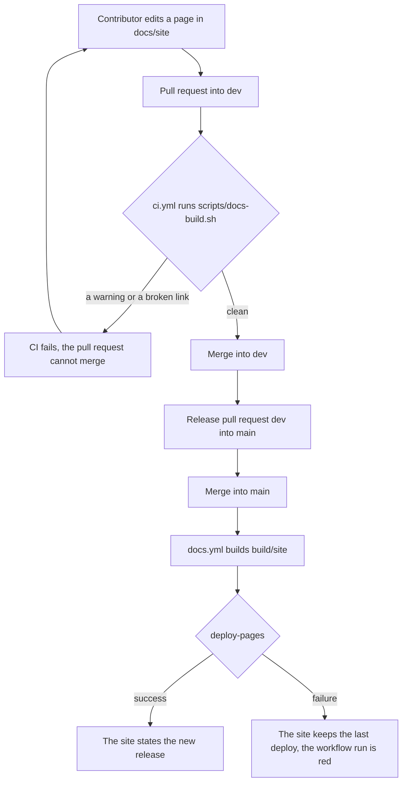
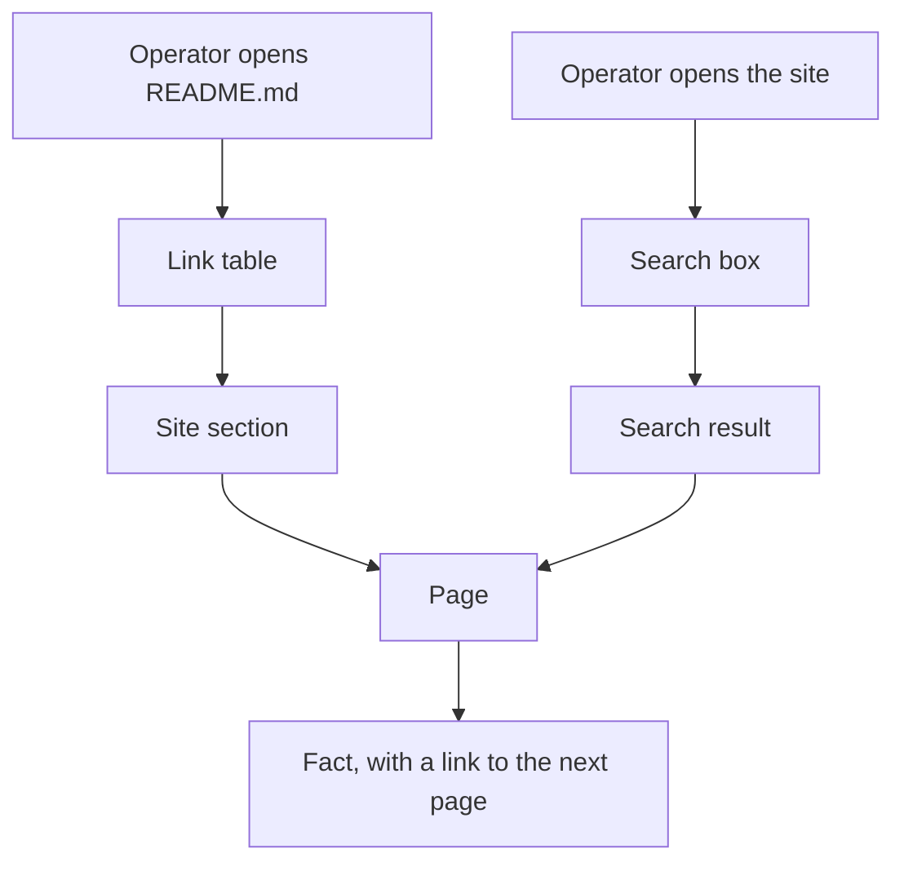

## Purpose

`README.md` holds 1468 lines. It states what Hydrascale does, how to install it, and then
the whole reference: the local rules, the upstream policy, the credentials, host access,
DNS, networking, the configuration keys, the command line, the control API, daemon mode,
the architecture, the uninstall, and the troubleshooting. An operator who wants one fact
scrolls through all of it. The repository also holds a manual under `docs/manual/`, an
upgrade guide, and a security audit that the README does not reach.

This feature set publishes one documentation site on GitHub Pages. The site holds the
operator documentation in sections with a navigation and a search. The README keeps the
introduction and links to the site. `features/15-readme-slim.md` shortens the README.

The site builds with MkDocs and the Material for MkDocs theme. The theme takes the brand
of the console: the lime accent on the warm dark surfaces, Barlow Semi Condensed, and
Martian Mono. The site publishes from `main`, so the site always states the newest
release.

## User stories

- As an operator, I want one page per topic with a search, so that I find a configuration
  key without a scroll through the README.
- As an operator, I want the documentation of the release that I run, so that the site
  states no feature that my release lacks.
- As an operator, I want the security audit on the site, so that I can judge the daemon
  before I install it.
- As a contributor, I want the build to fail on a broken link, so that a moved page never
  reaches the site with a dead link.

## Functional requirements

### Source and build

- **FR-site-1** — `mkdocs.yml` at the repository root declares the site.
- **FR-site-2** — `mkdocs.yml` sets `docs_dir` to `docs/site`.
- **FR-site-3** — `mkdocs.yml` sets `site_dir` to `build/site`, which `.gitignore` already
  ignores through the entry `build/`.
- **FR-site-4** — `mkdocs.yml` sets `site_url` to `https://crank-git.github.io/Hydrascale/`.
- **FR-site-5** — `docs/site/requirements.txt` pins `mkdocs-material==9.7.7`.
- **FR-site-6** — `scripts/docs-build.sh` copies the brand font files and the logo from
  `internal/ui/static/brand/` into `docs/site/assets/brand/`, then runs
  `mkdocs build --strict`.
- **FR-site-7** — `.gitignore` ignores `docs/site/assets/brand/`, so the repository
  holds one copy of each font file and of the logo.
- **FR-site-8** — `scripts/docs-build.sh` exits non-zero when `mkdocs build --strict`
  reports a warning.
- **FR-site-9** — The `CLAUDE.md` command list names `scripts/docs-build.sh`.

### Navigation and pages

- **FR-site-10** — The navigation holds these sections, in this order: Home, Get started,
  Guides, Concepts, Reference, Operations, Architecture, Security.
- **FR-site-11** — Home states what Hydrascale does, shows the Overview screenshot, and
  links to Get started.
- **FR-site-12** — Get started holds the requirements, the install of a released binary,
  the build from source, and the quick start.
- **FR-site-13** — Guides holds the console tour, the access editor, the policy editor,
  and the visual editor. These are the four pages of `docs/manual/`.
- **FR-site-14** — Guides holds a credentials page, a host access page, and a Headscale
  page.
- **FR-site-15** — Concepts holds a page for the local rules and their two modes, for the
  upstream policy, for DNS, and for networking.
- **FR-site-16** — The networking page states IP forwarding, the veth pairs, NAT, direct
  connections and the listen port of each namespace, IPv6, and Docker.
- **FR-site-17** — Reference holds a page for the configuration file, the command line,
  the environment variables, the control API, and the events.
- **FR-site-18** — The configuration page states every key that `internal/config` reads.
- **FR-site-19** — The events page states every event type that the daemon records.
- **FR-site-20** — Operations holds a page for daemon mode, remote access, the upgrade,
  the uninstall, and the troubleshooting.
- **FR-site-21** — The upgrade page holds the content of `docs/UPGRADING.md`.
- **FR-site-22** — Architecture holds the architecture diagram and its text.
- **FR-site-23** — Security holds a page that states that the console has no
  authentication, and the controls that reduce the risk.
- **FR-site-24** — Security holds the security audit.
- **FR-site-25** — The site holds no page for `docs/DESIGN.md` and no page for the
  specification.

### Moved files

- **FR-site-26** — `git mv` moves `docs/manual/*.md` into `docs/site/guides/`.
- **FR-site-27** — `git mv` moves `docs/images/` to `docs/site/images/`.
- **FR-site-28** — `git mv` moves `docs/UPGRADING.md` to `docs/site/operations/upgrade.md`.
- **FR-site-29** — `git mv` moves `docs/security-audit.md` to
  `docs/site/security/audit.md`.
- **FR-site-30** — Every link in the repository that names a moved file names its new
  path.

### Theme

- **FR-site-31** — `mkdocs.yml` sets `theme.name` to `material` and `theme.font` to
  `false`, so the site loads no font from another host.
- **FR-site-32** — `docs/site/stylesheets/brand.css` declares an `@font-face` rule for
  each file of `docs/site/assets/brand/fonts/`.
- **FR-site-33** — `brand.css` sets `--md-text-font` to Barlow Semi Condensed and
  `--md-code-font` to Martian Mono.
- **FR-site-34** — The site has one colour scheme, which is dark.
- **FR-site-35** — `brand.css` sets the page background to `#0d0c0b`, the body text to
  `#eceae6`, and the accent to `#c8ff2e`.
- **FR-site-36** — The accent marks the current navigation entry and nothing else. A link
  takes the body colour and an underline, as a link of the console does.
- **FR-site-37** — The header shows the lime mark and the wordmark `hydrascale`.
- **FR-site-38** — A built page requests no resource from a host other than the site
  host. The search runs in the browser.

### Publish

- **FR-site-39** — `.github/workflows/docs.yml` builds the site on a push to `main`, and
  on a manual run.
- **FR-site-40** — The workflow deploys `build/site` with `actions/configure-pages@v6`,
  `actions/upload-pages-artifact@v5`, and `actions/deploy-pages@v5`.
- **FR-site-41** — The deploy job holds the permissions `pages: write` and
  `id-token: write`, and it runs in the environment `github-pages`.
- **FR-site-42** — The publishing source of the repository is GitHub Actions.
- **FR-site-43** — `.github/workflows/ci.yml` runs `scripts/docs-build.sh` on every pull
  request, so a broken link fails the pull request and never reaches `main`.

### Content rules

- **FR-site-44** — Every page follows `.claude/rules/ste.md` and the Terms table of
  `docs/specs/spec.md`.
- **FR-site-45** — Every screenshot on the site shows placeholder data. No screenshot
  shows a real tailnet name, a real peer name, or a real tailnet address.
- **FR-site-46** — Every page that moves out of `README.md` keeps the facts of the
  README. A fact that the move finds wrong is corrected against the code, and the pull
  request names the correction.

## User flows

### Flow 1: A change reaches the site

1. A contributor edits a page under `docs/site/`.
2. The contributor opens a pull request into `dev`.
3. `ci.yml` runs `scripts/docs-build.sh`.
4. If the build reports a warning or a broken link, CI fails and the pull request cannot
   merge. The contributor fixes the page.
5. The release pull request merges `dev` into `main`.
6. `docs.yml` builds the site and deploys it.
7. If the deploy fails, the site keeps the last deploy and the workflow run shows the
   failure.

### Flow 2: An operator finds a fact

1. The operator opens the README, or the site.
2. From the README, the operator follows a row of the link table to a site section.
3. On the site, the operator types into the search box and selects a result.
4. The page states the fact.

## Screens & states

The site uses the page layout of Material for MkDocs: a header, a navigation column, the
page, and a table of contents of the page. The brand changes the colours and the fonts,
not the layout.

- **Header.** The lime mark, the wordmark, the search box, and a link to the repository.
- **Navigation.** The eight sections of FR-site-10. The current page is the one accent use
  of the navigation.
- **Search, empty result.** The theme states that no page matches.
- **Phone.** The theme moves the navigation into a drawer. No page scrolls sideways at
  390 pixels.

## Behaviour rules

- The site publishes from `main` alone. A page change on `dev` reaches the site with the
  next release.
- The site holds one version: the newest release. It holds no version selector.
- A page states a command, a key, and a path in the mono typeface, inside backticks.

## Data touched

No data of the daemon. The repository gains `mkdocs.yml`, `docs/site/`,
`scripts/docs-build.sh`, and `.github/workflows/docs.yml`, and the moved files of
FR-site-26 to FR-site-29.

## Interfaces

- **MkDocs and Material for MkDocs.** Package `mkdocs-material` version 9.7.7, which
  requires `mkdocs>=1.6,<2` and Python 3.8 or later
  (`https://pypi.org/pypi/mkdocs-material/json`, read 2026-10-07). `theme.font: false`
  stops the Google Fonts request, and the custom properties `--md-text-font` and
  `--md-code-font` set the fonts
  (`https://squidfunk.github.io/mkdocs-material/setup/changing-the-fonts/`, read
  2026-10-07).
- **GitHub Pages from a custom workflow.** The publishing source is GitHub Actions. The
  deploy job needs `pages: write` and `id-token: write`, and the environment
  `github-pages`
  (`https://docs.github.com/en/pages/getting-started-with-github-pages/using-custom-workflows-with-github-pages`,
  read 2026-10-07). The newest releases on 2026-10-07 are `actions/configure-pages`
  v6.0.0, `actions/upload-pages-artifact` v5.0.0, `actions/deploy-pages` v5.0.1, and
  `actions/setup-python` v7.0.0. `.github/workflows/release.yml` pins each action to the
  newest major version for the same reason.
- **Enable Pages.** The repository has no Pages site on 2026-10-07
  (`GET /repos/Crank-Git/Hydrascale/pages` returns 404). The operator, or the worker with
  the operator's consent, creates it with
  `gh api -X POST repos/Crank-Git/Hydrascale/pages -f build_type=workflow`.

## Edge cases & failures

- **A page links to a moved file.** `mkdocs build --strict` fails on the dead link, and
  CI fails the pull request.
- **A brand font file changes name.** `scripts/docs-build.sh` copies the directory, and
  `brand.css` names each file. A test compares the two lists.
- **The deploy fails after a release.** The site keeps the last deploy. The release is
  not blocked, because the release workflow and the docs workflow are separate.
- **A screenshot holds real data.** The review of the pull request refuses it, per
  FR-site-45.

## Acceptance criteria

- `scripts/docs-build.sh` exits 0 on a fresh clone, and `build/site/index.html` exists.
- A page that links to a missing file makes `scripts/docs-build.sh` exit non-zero.
- `https://crank-git.github.io/Hydrascale/` serves the site after the first merge into
  `main` that holds this feature.
- The navigation shows the eight sections of FR-site-10 in order.
- A search for `route_table` returns the configuration page.
- The configuration page names every key of `internal/config`. A test lists the keys of
  the configuration struct and fails when the page omits one.
- `build/site` holds no reference to `fonts.googleapis.com` and no `<script>` or
  `<link>` element whose URL names another host.
- `docs/manual/`, `docs/images/`, `docs/UPGRADING.md`, and `docs/security-audit.md` no
  longer exist, and no file of the repository links to them.
- At 390 pixels no page scrolls sideways.

## Out of scope

- A version selector, and a page per older release.
- A custom domain.
- A blog, a changelog page, and translations.
- A page for `docs/DESIGN.md` or for the specification.

## Open questions

None.
