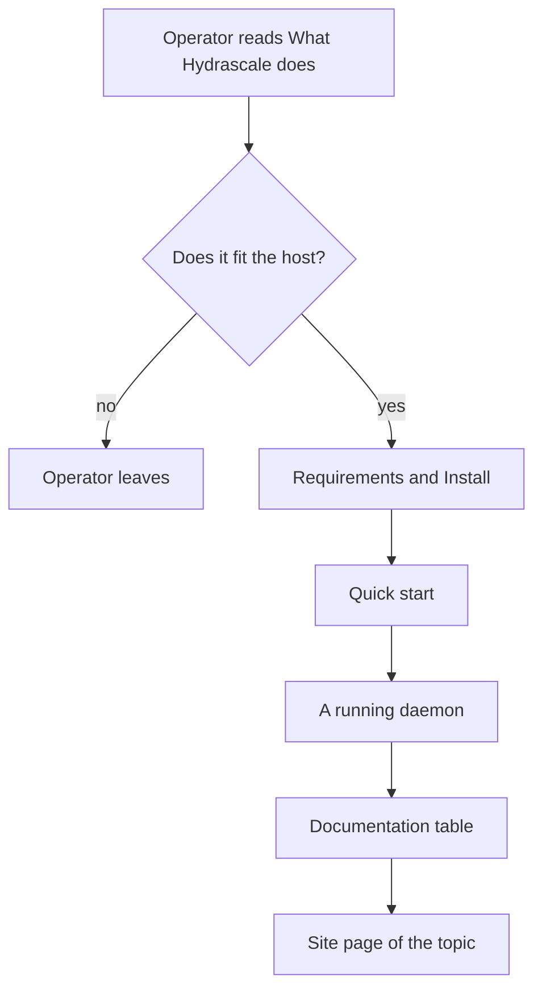

## Purpose

This is a delta feature. It changes the README that `features/09-docs-and-release.md`
built.

`README.md` holds 1468 lines. After `features/14-docs-site.md`, the documentation site
holds every topic. The README then needs to do three things: state what Hydrascale does,
get the operator to a running daemon, and send the operator to the site for the rest.

## Requirements this feature changes

`features/09-docs-and-release.md` and `features/10-agent-skills.md` state where some facts
live. This feature moves them to the site:

| Requirement | Was | Becomes |
|---|---|---|
| FR-docs-2 | `README.md` describes the console, the local rules, and the upstream policy. | The README holds one paragraph and one screenshot of the console. The site describes the local rules and the upstream policy. |
| FR-docs-4 | `README.md` states that the console has no authentication. | Unchanged. The README keeps one sentence and links to the Security section. |
| FR-docs-5 | `README.md` states the `socket_group` warning. | The Security section of the site states it. |
| FR-docs-6 | `README.md` documents every configuration key. | The configuration page of the site documents every key (FR-site-18). |
| FR-docs-7, FR-docs-8 | `README.md` documents the credential setup and the Headscale requirement. | The credentials page and the Headscale page of the site state them. |
| FR-docs-9 | The table of contents matches the sections. | The README holds no table of contents. It is short enough to read whole. |
| FR-skills-34 | `README.md` holds one section that states the skills commands. | Unchanged. The README keeps the section and links to the Reference section for the details. |

When this feature merges, the PM updates the two built feature files so that they state
the new location of each fact.

## User stories

- As an operator who finds the repository, I want to know what Hydrascale does in one
  screen, so that I decide whether it fits my host.
- As an operator, I want the install and the quick start in the README, so that I reach a
  running daemon without leaving GitHub.
- As an operator, I want one link per topic, so that I reach the right page of the site.

## Functional requirements

- **FR-readme-1** — `README.md` holds 220 lines or fewer.
- **FR-readme-2** — `README.md` holds these sections, in this order: the header, What
  Hydrascale does, Requirements, Install, Quick start, The console, Documentation, Agent
  skills, License.
- **FR-readme-3** — The header keeps the mark, the name, the one-line summary, and the
  badges.
- **FR-readme-4** — What Hydrascale does holds three paragraphs or fewer.
- **FR-readme-5** — The console section holds one screenshot and one paragraph, and the
  paragraph states that the console has no authentication.
- **FR-readme-6** — The Documentation section holds a table with one row per section of
  the site: the section name, what it holds, and an absolute link to it.
- **FR-readme-7** — The Agent skills section states `hydrascale skills install` and links
  to the skills page of the site.
- **FR-readme-8** — Every link of the README to a site page uses the absolute URL under
  `https://crank-git.github.io/Hydrascale/`.
- **FR-readme-9** — Every link of the README to a file of the repository names a file
  that exists.
- **FR-readme-10** — `README.md` holds no fact that the site does not also state, apart
  from the install and the quick start.
- **FR-readme-11** — Every screenshot in `README.md` comes from `docs/site/images/`.

## User flows

### Flow 1: From the README to the answer

1. The operator reads What Hydrascale does.
2. If the tool fits the host, the operator reads the requirements and installs it.
3. The quick start brings the operator to a running daemon.
4. For any other topic, the operator follows a row of the Documentation table.

## Screens & states

One state: the README as GitHub renders it. The README holds no section that only a
wide screen shows.

## Behaviour rules

- The README states no configuration key apart from those the quick start uses.
- The README states no troubleshooting step.

## Data touched

`README.md` only.

## Interfaces

None. The site URLs come from `features/14-docs-site.md` (FR-site-4).

## Edge cases & failures

- **A site page moves.** `scripts/docs-build.sh` does not check the README. A test reads
  each absolute site link of the README and checks that the page exists under
  `docs/site/`.
- **A section of the old README has no site page.** The pull request lists each removed
  section and names its site page. A section without a page blocks the merge.

## Acceptance criteria

- `wc -l README.md` prints 220 or less.
- The sections of `README.md` match FR-readme-2 in order.
- Each absolute site link of the README maps to a file under `docs/site/`, and a test
  fails when one does not.
- Each repository link of the README names a file that exists.
- The pull request maps every removed README section to a site page.

## Out of scope

- A new screenshot. The README reuses the screenshots of `docs/site/images/`.

## Open questions

None.
