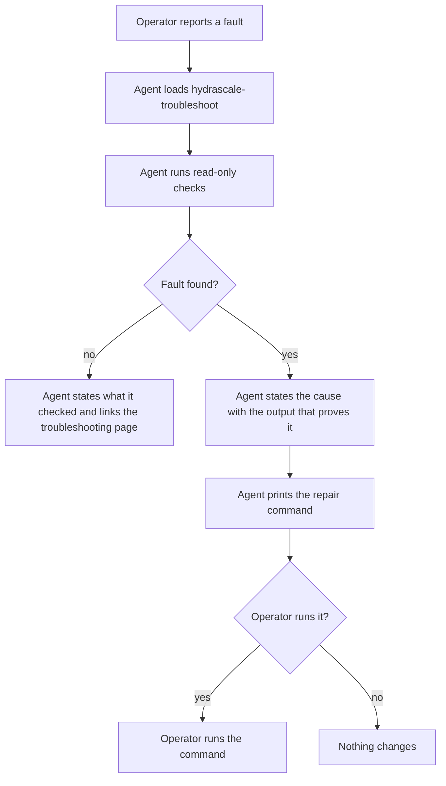
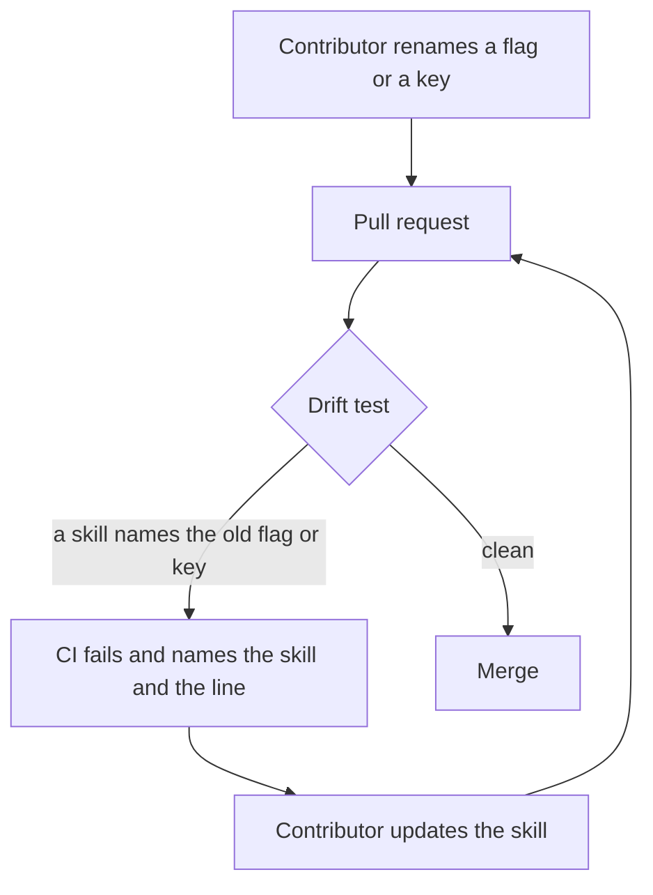

## Purpose

This is a delta feature. It changes the skills that `features/10-agent-skills.md` built.

The two skills that `hydrascale skills install` ships were written for version 1.1, and
no line of them changed after 2026-08-10. Versions 1.2 to 1.5 added aliases, the policy
routes, IPv6, a listen port for each namespace, a new uninstall, and a redesigned console.
A survey of the skills on 2026-10-07 found these defects:

- `hydrascale-setup` states that only `status` needs `sudo`. `diff`, `list`, and `env`
  also need it.
- `hydrascale-setup` omits five commands that change the host: `uninstall`,
  `init --force`, `wrap --apply`, the terminal interface, and Push in the console.
- `tailnet-exec` states that a failed `hydrascale status` means that the daemon does not
  run. `status` reads the host directly when the socket is absent, so this is false.
- `tailnet-exec` states that only `exec` needs root. `ping`, `ssh`, and `tailscale` also
  run through `ip netns exec`.
- Neither skill states the tailnet alias, the alias zone, IPv6, the listen ports, or the
  events that versions 1.2 to 1.5 added.
- The four contributor skills under `.claude/skills/` name a test that does not exist, an
  SSH alias that does not exist, and a script that "Epic 1 adds", and they omit half of
  the CI gate.
- `cmd/hydrascale/skills_drift_test.go` checks the command path of each form and nothing
  else, so every defect above passes CI.

This feature rewrites the two skills, adds a third skill for troubleshooting, corrects
the contributor skills, and makes the drift test catch the next drift. Each skill links
to the documentation site that `features/14-docs-site.md` builds.

## User stories

- As an operator, I want my coding agent to know which commands need `sudo`, so that it
  does not fail and then guess.
- As an operator, I want my coding agent to stop before any command that changes the
  host, so that it never runs an uninstall that I did not ask for.
- As an operator, I want my coding agent to diagnose IPv6, direct connections, DNS, and a
  credential fault with read-only commands, so that it explains a fault before it changes
  anything.
- As a contributor, I want the contributor skills to state the real gate, so that an
  agent runs every check that CI runs.
- As a maintainer, I want CI to fail when a skill names a flag or a key that the code
  does not hold, so that the skills cannot drift silently again.

## Functional requirements

### hydrascale-setup

- **FR-refresh-1** — The skill states each read-only command with its `sudo` need:
  `status`, `diff`, `list`, `env`, and `version`.
- **FR-refresh-2** — The `allowed-tools` field of the skill names each read-only command
  of FR-refresh-1 in the form the skill states it.
- **FR-refresh-3** — The skill states every status value that `hydrascale status`
  prints, and the `ALIAS` column.
- **FR-refresh-4** — The skill names every command that changes the host or a tailnet:
  `apply`, `add`, `remove`, `init`, `init --force`, `uninstall` with each of its flags
  (`--yes`, `--purge`, `--keep-nodes`), `wrap --apply`, and the terminal interface. It
  also names the console actions Connect, Disconnect, Remove, Apply, and Push. For each
  one the skill prints the command and does not run it.
- **FR-refresh-5** — The skill states that Push changes the policy of every device in a
  tailnet, not only this host.
- **FR-refresh-6** — The skill states the configuration keys of version 1.5 that an
  operator sets most: `alias`, `resolver.resolve_aliases`, `route_table`, `ipv6`,
  `host_dns.mode`, and `socket_group`, and links to the configuration page of the site
  for the rest.
- **FR-refresh-7** — The skill states that membership of `socket_group` gives the access
  of root.
- **FR-refresh-8** — The skill states the upgrade to version 1.0 as a section of its own,
  for a host that still runs version 0.9 or 0.10. It no longer frames that upgrade as the
  current path.
- **FR-refresh-9** — The skill states that an SSH tunnel to the console works on any
  local port.

### tailnet-exec

- **FR-refresh-10** — The skill states that `hydrascale status` reads the host directly
  when the daemon does not run, and that a namespace that `status` lists still takes a
  routing form.
- **FR-refresh-11** — The skill states that `exec`, `ping`, `ssh`, and `tailscale` each
  need root, because each runs `ip netns exec`.
- **FR-refresh-12** — The skill states that every routing form takes a tailnet alias in
  place of the tailnet ID, and that the namespace name stays `ns-<ID>`.
- **FR-refresh-13** — The skill states that a routing form reads the configuration file,
  so it needs read access to `/etc/hydrascale`.
- **FR-refresh-14** — The skill states that `wrap` prints a unit drop-in and that
  `wrap --apply` installs it, which changes the host.
- **FR-refresh-15** — The skill states the alias zone name `<peer>.<alias>.ts.internal`.

### hydrascale-troubleshoot

- **FR-refresh-16** — `skills/hydrascale-troubleshoot/SKILL.md` exists, and
  `hydrascale skills install` installs it with the other two skills.
- **FR-refresh-17** — The skill runs read-only commands only. Its `allowed-tools` field
  names no command that changes the host.
- **FR-refresh-18** — The skill states a diagnosis for IPv6: the event `ipv6.state`, the
  `ipv6` key, the upstream device, and the NAT66 rule.
- **FR-refresh-19** — The skill states a diagnosis for a direct connection: the listen
  port of each namespace in the range 41642 to 41895, the forward rule of that port, and
  `tailscale netcheck` inside the namespace.
- **FR-refresh-20** — The skill states a diagnosis for DNS: `host_dns.mode`, the overlay
  mount, the event `dns.unprotected`, and a split DNS conflict with the event
  `dns.split_domain_conflict`.
- **FR-refresh-21** — The skill states a diagnosis for a displaced jump rule: the event
  `access.jump_displaced`, and the chains that Docker and tailscaled add.
- **FR-refresh-22** — The skill states a diagnosis for a policy credential that the
  control server rejected, and it states that an absent credential is not a fault.
- **FR-refresh-23** — For each diagnosis, the skill prints the command that repairs the
  fault and does not run it.
- **FR-refresh-24** — Each diagnosis links to the matching page of the site.

### Contributor skills

- **FR-refresh-25** — `.claude/skills/run/SKILL.md` names no test that does not exist,
  names the SSH target `phobos@192.168.1.221`, and names the e2e suite in `e2e/`.
- **FR-refresh-26** — `.claude/skills/test/SKILL.md` states every step of
  `.github/workflows/ci.yml`, including `scripts/check-hygiene.sh`, `govulncheck`, and
  `scripts/docs-build.sh`, and the `node` and `python3` needs of the suite.
- **FR-refresh-27** — `.claude/skills/check-hygiene/SKILL.md` states that the script
  exists and that CI runs it.
- **FR-refresh-28** — `.claude/skills/verify-on-phobos/SKILL.md` checks the IPv6 chains,
  the chain `HYDRASCALE-OUT`, the NAT66 rule, the forward rule of each listen port, the
  routing policy rule of the route table, and `force_forwarding`.

### Drift test

- **FR-refresh-29** — The drift test fails when a skill names a flag that its command
  does not declare.
- **FR-refresh-30** — The drift test fails when a skill names a configuration key in
  backticks that `internal/config` does not read.
- **FR-refresh-31** — The drift test fails when a skill names an event type that the
  daemon does not record.
- **FR-refresh-32** — The test of `skills/` reads the skill list from the embedded
  directory, so a new skill without a test fails the suite.
- **FR-refresh-33** — A skill names no source line in the form `file.go:NN`, because a
  line number moves with each edit. The drift test fails on such a reference.
- **FR-refresh-34** — Every link of a skill to the site uses the absolute URL under
  `https://crank-git.github.io/Hydrascale/`, and a test checks that the page exists under
  `docs/site/`.

### Documentation

- **FR-refresh-35** — The skills page of the site states the three skills, the `--dir`
  flag of `hydrascale skills install`, and that the command refuses to run as root.

## User flows

### Flow 1: An agent diagnoses a fault

1. The operator reports a fault.
2. The coding agent loads `hydrascale-troubleshoot`.
3. The agent runs read-only checks.
4. If the agent finds no fault, it states what it checked and links the troubleshooting
   page.
5. If the agent finds the fault, it states the cause with the output that proves it.
6. The agent prints the repair command. The operator decides whether to run it.

### Flow 2: CI catches drift

1. A contributor renames a flag, a key, or an event.
2. The drift test reads each skill.
3. If a skill names the old form, CI fails and names the skill and the line.
4. The contributor updates the skill, and CI passes.

## Screens & states

No screen. A skill is a Markdown file that a coding agent reads.

## Behaviour rules

- A skill runs a command that changes the host only when the operator asks for that
  command in the same turn. In every other case it prints the command.
- A skill states a fact that the site also states once, and links to the site for the
  detail.
- Every skill follows `.claude/rules/ste.md` and the Terms table.

## Data touched

`skills/hydrascale-setup/SKILL.md`, `skills/tailnet-exec/SKILL.md`,
`skills/hydrascale-troubleshoot/SKILL.md`, `skills/embed.go`, `skills/skills_test.go`,
`cmd/hydrascale/skills_drift_test.go`, and the four files under `.claude/skills/`.

## Interfaces

The skill format is the one that `features/10-agent-skills.md` states: a Markdown file
with the front-matter keys `name`, `description`, and `allowed-tools`.

## Edge cases & failures

- **A skill states a flag in prose rather than in a command form.** The drift test reads
  a flag only in a command form that starts with `hydrascale `. A flag in prose is a
  review item.
- **A configuration key shares a name with a policy key.** The drift test reads a key
  only in the form that the configuration file uses, such as `host_dns.mode`. A key of a
  policy document, such as `tagOwners`, is not checked.
- **The site moves a page.** The link test of FR-refresh-34 fails, and the skill changes
  in the same pull request as the move.

## Acceptance criteria

- `hydrascale skills install --dir <tmp>` writes three skill directories.
- A skill that names `hydrascale uninstall --no-such-flag` fails the drift test with the
  skill name and the line.
- A skill that names `route_tables` in backticks fails the drift test.
- A skill that names `internal/api/console.go:16` fails the drift test.
- A new directory under `skills/` with no test entry fails `go test ./skills/...`.
- `hydrascale-setup` states `sudo` for `status`, `diff`, `list`, and `env`.
- `tailnet-exec` states that `ping`, `ssh`, and `tailscale` need root.
- `hydrascale-troubleshoot` holds five diagnoses, each with a read-only check, a printed
  repair command, and a site link.
- `.claude/skills/run/SKILL.md` names no `TestConsoleServer`.
- `.claude/skills/test/SKILL.md` names every step of `.github/workflows/ci.yml`.

## Out of scope

- A skill for policy edits. The console owns that task, and no command line form edits a
  policy.
- A test that runs a skill inside a coding agent.

## Open questions

None.
