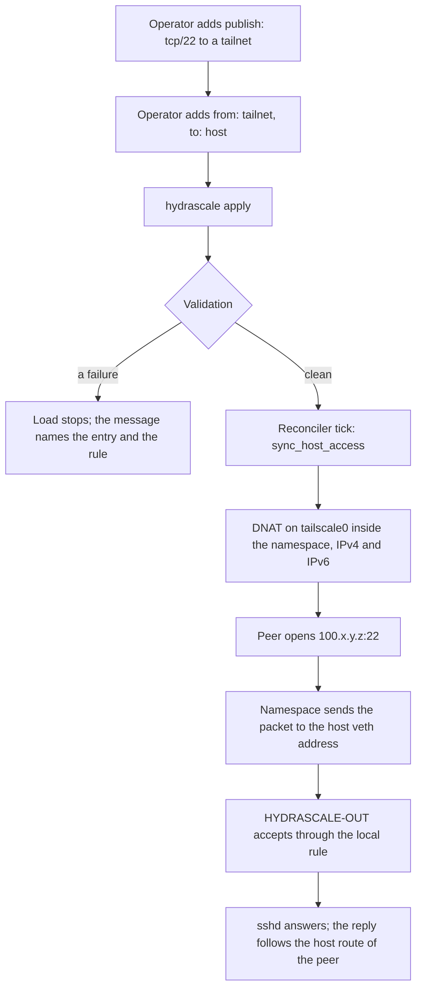
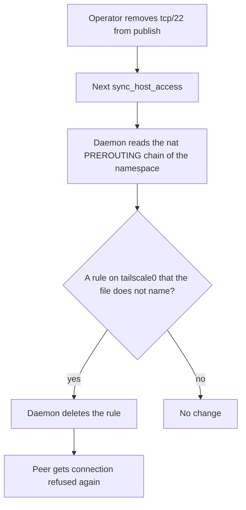
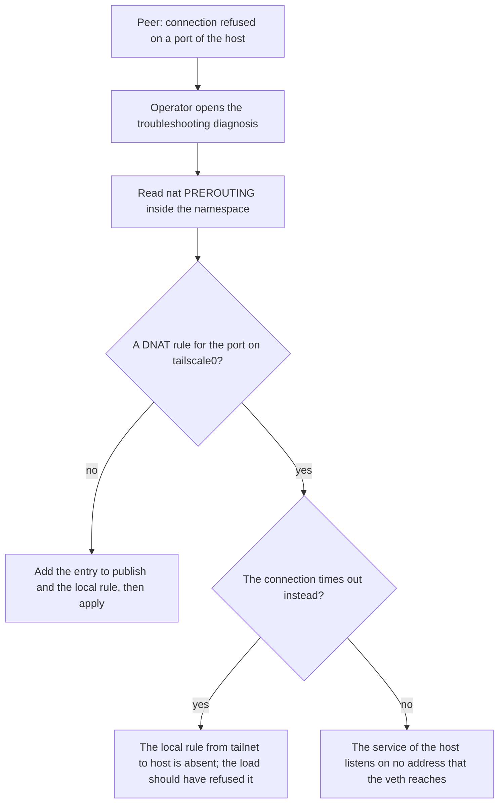

## Purpose

This is a delta feature. It changes the host access that `features/00-foundation.md`
describes and the namespace rules that `features/05-reachability-model.md` governs.

The Tailscale address of a managed tailnet lives inside its namespace. A peer that opens
a connection to that address reaches `tailscale0` inside the namespace, where no service
listens, so the kernel of the namespace answers with a reset. Issue #459 measured this: a
peer pinged the namespace and got an answer, and the same peer got "connection refused"
on port 22, 8888, and every other port. Host access carries the traffic of the host to
the peers. It carries no connection from a peer to a service of the host.

A **published port** closes that gap. The operator names a port of the host in the
configuration file. The daemon then writes one DNAT rule inside the namespace, which
sends an inbound connection for that port from `tailscale0` to the host side veth
address. The local rule `from: <tailnet>, to: host` gates the connection on the host, as
it gates every packet that the namespace sends to the host. The test host measured the
path on 2026-10-09: with the DNAT rule alone the connection timed out in
`HYDRASCALE-OUT`, and with the local rule a peer on another machine opened an SSH
session to `sshd` on the host.

## Decisions

The operator decided these points on 2026-10-09:

- The local rule gates the published port, and the configuration load refuses a
  published port that no rule covers. A published port that the rule set denies is a
  contradiction in the file, and the daemon rejects a bad value rather than records it.
- A published port covers IPv4 and IPv6.
- The console shows the published ports of a tailnet on the namespace detail, and it
  does not edit them.

## User stories

- As an operator, I want a peer of a tailnet to reach `sshd` on the host through the
  address of that tailnet, so that I administer the host from the tailnet.
- As an operator, I want to publish a port to one tailnet and not to another, so that a
  tailnet that I keep isolated stays isolated.
- As an operator, I want the configuration load to tell me when a published port has no
  local rule, so that I do not search the kernel log for a dropped packet.
- As an operator, I want the console to show which ports a tailnet publishes, so that I
  read the state of the host in one place.

## Functional requirements

### The key

- **FR-publish-1** — The key `tailnets[].publish` holds a list of ports of the host that
  the peers of that tailnet reach. The key defaults to an empty list, which publishes no
  port.
- **FR-publish-2** — An entry of `publish` matches `tcp/<n>` or `udp/<n>`, where `<n>` is
  from 1 to 65535. A range is not an entry. The parser of the local rule ports reads the
  entry, so the two keys spell a port the same way.
- **FR-publish-3** — The daemon rejects a `publish` entry that is not of that form, and
  it rejects a duplicate entry in one tailnet. The message names the tailnet and the
  entry.
- **FR-publish-4** — The daemon rejects a `publish` list on a tailnet whose host access
  is off, because the namespace forwards no packet to the host without host access. The
  message names the tailnet.
- **FR-publish-5** — The daemon rejects a `publish` entry that no local rule
  `from: <tailnet>, to: host` covers. A rule with an empty port list covers every entry.
  A rule with a port list covers an entry when one of its ports, or one of its ranges,
  holds the protocol and the number of the entry. The message names the tailnet, the
  entry, and the rule that the file needs.
- **FR-publish-6** — The validation of FR-publish-3 to FR-publish-5 runs on the whole
  file before the daemon changes anything, and it reports every failure together, as
  the validation of the local rules does.

### The rules

- **FR-publish-7** — For each published port, the daemon writes one DNAT rule in the
  `nat PREROUTING` chain of `iptables` inside the namespace. The rule matches the input
  device `tailscale0`, the protocol, and the destination port of the entry, and it sends
  the packet to the host side veth IPv4 address of the namespace with the same port.
- **FR-publish-8** — For each published port, the daemon writes the same rule in
  `ip6tables` inside the namespace, with the host side veth IPv6 address that
  `VethIPv6` returns as the destination. The daemon writes the IPv6 rule only when the
  namespace holds the IPv6 path of FR-access-29.
- **FR-publish-9** — The daemon writes a rule that the namespace holds already no second
  time. It checks with `-C` and then appends with `-A`, as the DNS DNAT rules do.
- **FR-publish-10** — On each host access sync, the daemon removes a DNAT rule on
  `tailscale0` that the configuration no longer names. A rule for a port that the
  operator removed from the list leaves within one tick.
- **FR-publish-11** — The teardown of host access removes every published port rule of
  that namespace, together with the masquerade and the DNS DNAT rules, and it reports
  the failures together.
- **FR-publish-12** — A published port rule changes no other rule. The masquerade rule
  on `tailscale0` and the DNS DNAT rules on the veth keep their text.
- **FR-publish-13** — The host accepts the forwarded connection in `HYDRASCALE-OUT`
  through the local rule `from: <tailnet>, to: host` and no other rule. The daemon
  writes no accept for a published port in a chain of the host.
- **FR-publish-14** — The reply of the host to the peer leaves through the host route of
  that peer, which host access writes. The DNAT rule rewrites no source address, so the
  service of the host sees the Tailscale address of the peer.

### The status and the console

- **FR-publish-15** — `GET /api/status` carries the `publish` list of each tailnet in
  the `desired` map, in the order of the file.
- **FR-publish-16** — The namespace detail of the console holds one field `published`
  that lists each entry in the mono typeface, separated by one space. A tailnet that
  publishes no port shows the absent marker that the other fields use.
- **FR-publish-17** — The console offers no control that changes the list. The file is
  the only way to change a published port.

### The documentation and the skills

- **FR-publish-18** — The configuration page of the documentation site states the key
  `tailnets[].publish`, its form, its default, and the local rule that it needs.
- **FR-publish-19** — The host access guide gains one section that states what a
  published port does, with one example that publishes `tcp/22` to one tailnet and the
  rule that the example needs.
- **FR-publish-20** — The troubleshooting page gains one diagnosis for a peer that gets
  "connection refused" on a port of the host. The diagnosis reads the `nat PREROUTING`
  chain of the namespace, and it names the key and the rule that repair the cause.
- **FR-publish-21** — The skill `hydrascale-troubleshoot` holds the same diagnosis, and
  the skill `hydrascale-setup` states the key. The drift test reads the key from the
  code, so a skill that spells it wrong fails.

## User flows

### Flow 1: The operator publishes a port



1. The operator adds `publish: ["tcp/22"]` to a tailnet, and the rule
   `from: <tailnet>, to: host` with `ports: ["tcp/22"]` or an empty list.
2. The operator runs `hydrascale apply`, or the reconciler reads the file on the next
   tick.
3. The daemon validates the whole file. A failure stops the load with a message that
   names the tailnet, the entry, and the rule that the file needs.
4. On the next host access sync, the daemon writes the DNAT rule inside the namespace.
5. A peer opens the port on the Tailscale address of the namespace, and the service of
   the host answers.

### Flow 2: The operator removes a published port



### Flow 3: A peer gets "connection refused"



## Screens & states

The namespace detail of the console gains one field. The field sits after `host access`
and before `exit node`:

```
namespace       ns-test
address         100.72.0.222
magicdns        test-host.tail1234.ts.net
control server  —
host access     on
published       tcp/22 tcp/8888
exit node       —
```

A tailnet with an empty list shows the absent marker in the `published` field. The
field is read-only. No new view, no new dialog, and no new mockup.

## Behaviour rules

- A published port follows `host_access`. When host access goes off, the published
  port rules leave with the other host access rules.
- The DNAT rule rewrites the destination only. The source stays the address of the peer.
- The daemon reads the configuration for the published ports on each sync, so an edit
  of the file reaches the namespace within one tick after `hydrascale apply`.
- A published port reaches the address of the host side veth device. A service that
  listens on `127.0.0.1` alone, such as the console, stays unreachable. The guide states
  this.
- The local rule `from: <tailnet>, to: host` also allows the namespace to reach the veth
  address of the host on the ports it names. A published port adds no reach beyond that
  rule.

## Data touched

| Data | Change |
|---|---|
| `tailnets[].publish` | New key, a list of `tcp/<n>` and `udp/<n>`. |
| `nat PREROUTING` inside the namespace | One DNAT rule per entry and per address family, on `tailscale0`. |
| `GET /api/status` | The `desired` map carries the list. |

## Interfaces

- `iptables -t nat` and `ip6tables -t nat` inside the namespace, through `execx.Runner`,
  with the argument lists that a test asserts:
  `ip netns exec <ns> iptables -t nat -A PREROUTING -i tailscale0 -p tcp -m tcp --dport 22 -j DNAT --to-destination <host veth IPv4>:22`
  and the same with `ip6tables` and `[<host veth IPv6>]:22`.
- `iptables -t nat -S PREROUTING` inside the namespace, to read the rules that the sync
  removes.

## Edge cases & failures

| Case | Behaviour |
|---|---|
| Two tailnets publish the same port. | Each namespace holds its own rule, and each peer reaches the host through its own tailnet. The rules do not meet. |
| The operator publishes a port and the local rule holds `tcp/20-30`. | The range covers `tcp/22`, so the load succeeds. |
| The operator publishes `udp/53`. | The DNAT on `tailscale0` and the DNS DNAT on the veth match different input devices, so both stay. A peer then reaches the DNS forwarder of the host only if the local rule names the port. |
| The host service listens on `127.0.0.1` alone. | The host veth address receives the packet and the kernel answers with a reset. The guide states that the service must listen on the veth address or on every address. |
| The namespace holds no IPv6 path. | The daemon writes the IPv4 rule alone and records no failure. |
| `ip6tables` is absent on the host. | The IPv6 write fails, the daemon records `access.write_failed` with the output, and the IPv4 rule stays. |
| The daemon restarts. | The namespace keeps its rules, and the first sync finds each rule with `-C` and writes none again. |
| The operator removes the tailnet from the file. | The namespace goes away with its rules. The host holds no rule for a published port, so nothing stays. |

## Acceptance criteria

- A configuration file with `publish: ["tcp/22"]` on a tailnet with host access and the
  rule `from: <tailnet>, to: host` loads, and a file with the same list and no such rule
  fails with a message that names the tailnet, `tcp/22`, and the rule.
- A file with `publish: ["tcp/22-23"]` fails. A file with `publish: ["tcp/22", "tcp/22"]`
  fails. A file with `publish` on a tailnet whose host access is off fails.
- A test on the runner asserts the exact `iptables` and `ip6tables` argument lists that a
  sync writes for one entry, and asserts that a second sync writes nothing.
- A test on the runner asserts that a sync deletes a DNAT rule on `tailscale0` that the
  file no longer names, and that it leaves the DNS DNAT rules on the veth in place.
- A test on the runner asserts that the teardown of host access deletes each published
  port rule.
- `GET /api/status` carries the list under `desired.<tailnet>.publish`.
- The console JavaScript tests assert the `published` field with two entries and with
  none.
- On the test host, a peer on another machine opens an SSH session to the host through
  the Tailscale IPv4 address of the namespace, and the connection is refused again
  within one tick after the entry leaves the file.
- The configuration page, the host access guide, and the troubleshooting page state the
  key, and the drift test passes.

## Out of scope

- A port range in `publish`. One entry publishes one port.
- A different port on the host than on the tailnet. The entry names one number.
- A published port that reaches a service in another namespace or in a container.
- A console control that edits the list.
- `tailscale serve` and `tailscale funnel`, which publish through the control server.

## Open questions

None.
